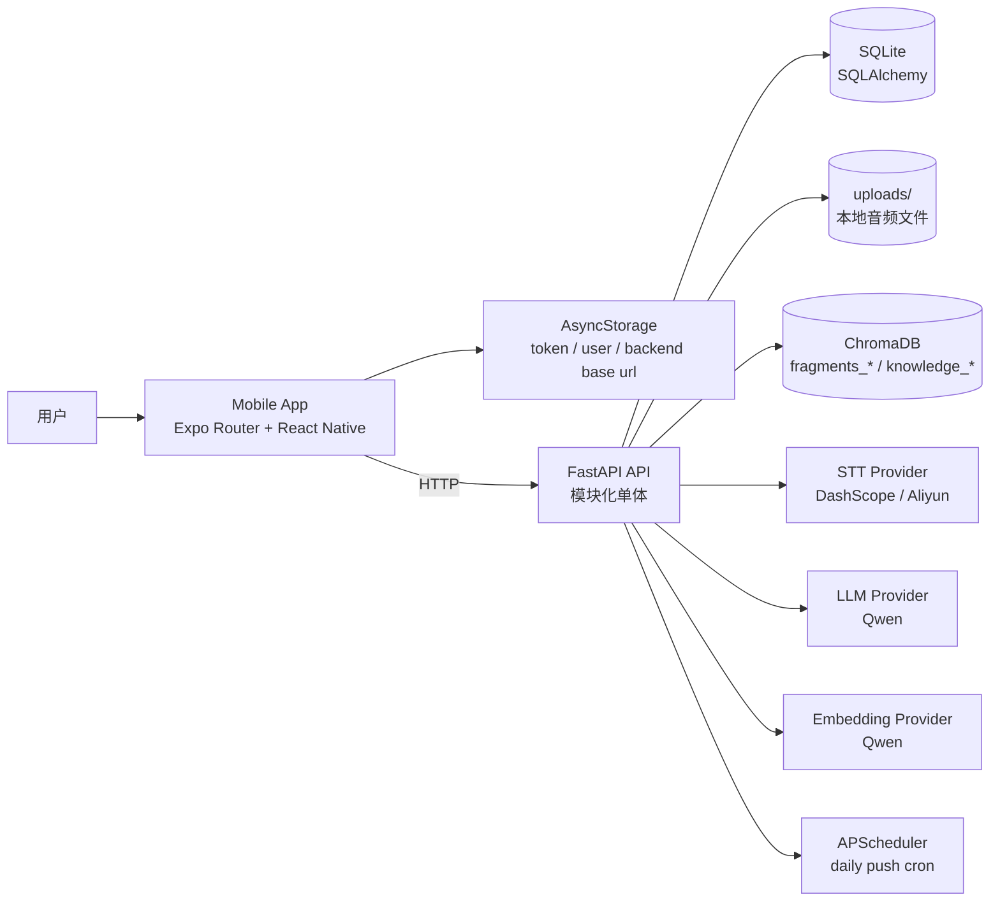
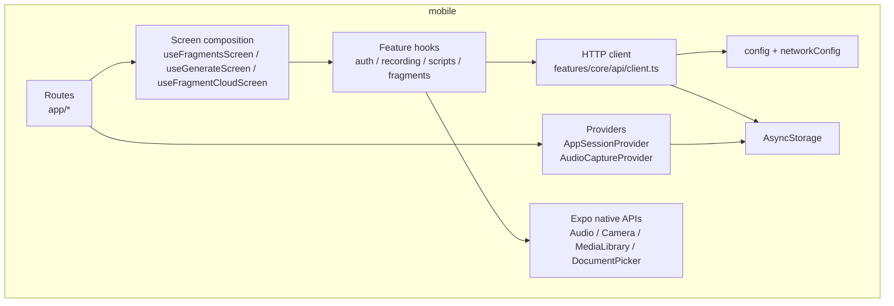
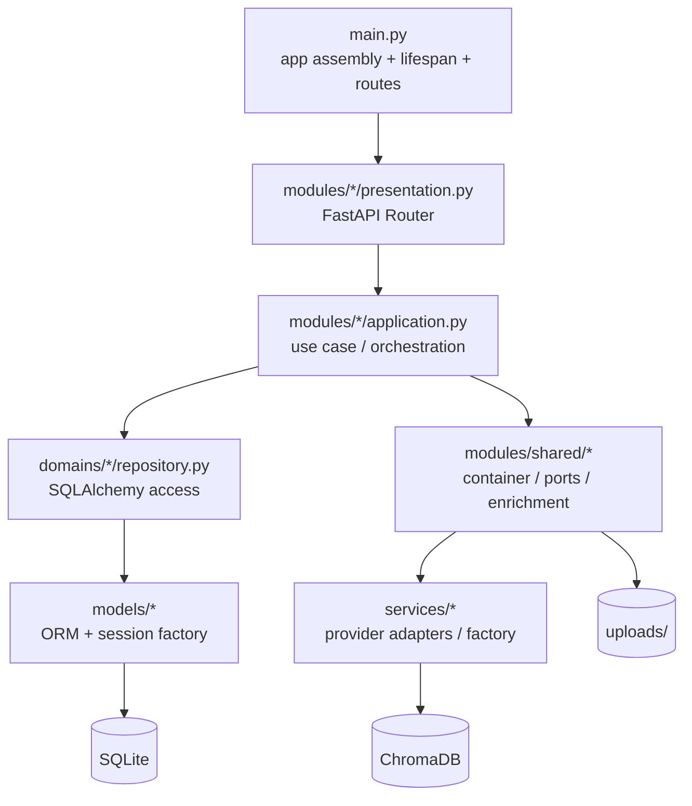
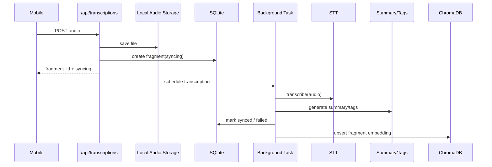
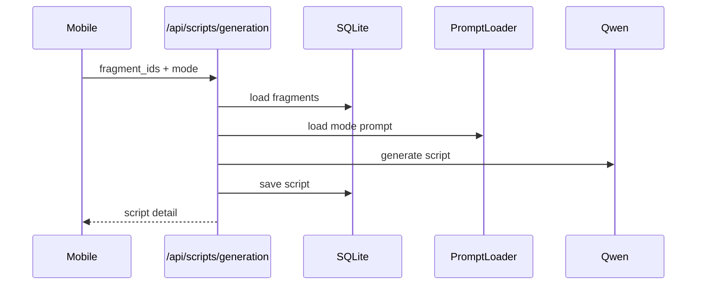
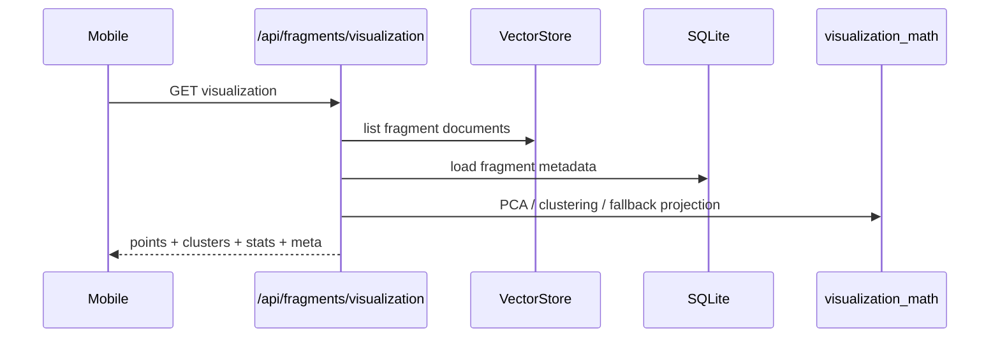
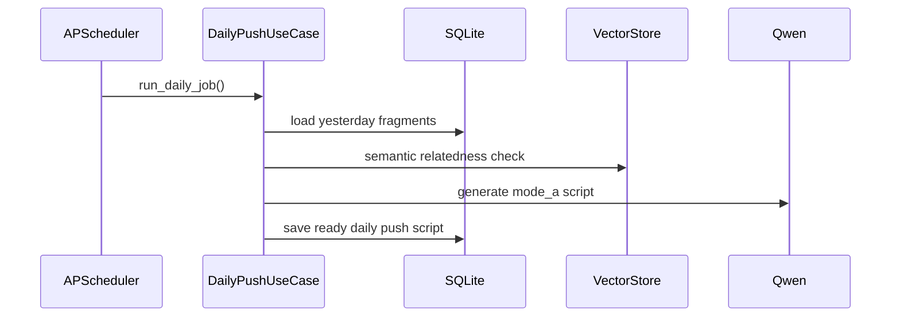

# SparkFlow Architecture

> 最后更新：2026-03-08

本文档描述当前仓库已经落地的实际架构，而不是早期规划版本。SparkFlow 目前是一个 Expo / React Native 移动端应用，配合 FastAPI 模块化单体后端运行。

## 1. Overall

## 2. Repository Shape

- `mobile/`: Expo 移动端，当前采用 stack 路由，不是 tab 路由。
- `backend/`: FastAPI 后端，业务入口已经收敛到 `modules/*`。
- `scripts/dev-mobile.sh`: 推荐本地联调入口，同时启动后端与 Expo。
- `memory-bank/`: 产品、架构、进度与实施记录。

## 3. Mobile Architecture

### 3.1 Routing

移动端路由位于 `mobile/app/`，由 [`mobile/app/_layout.tsx`](/Users/hujiahui/Desktop/VibeCoding/SparkFlow/mobile/app/_layout.tsx) 统一挂载 `Stack`。

当前主要页面：

- `index.tsx`: 实际首页，展示碎片列表、分组、选择态和底部快捷操作。
- `record-audio.tsx`: 录音与上传页。
- `text-note.tsx`: 手动文本碎片录入页。
- `fragment/[id].tsx`: 单条碎片详情。
- `fragment-cloud.tsx`: 灵感云图。
- `generate.tsx`: AI 编导生成确认页。
- `script/[id].tsx`: 口播稿详情。
- `scripts.tsx`: 口播稿列表。
- `shoot.tsx`: 提词器 + 相机拍摄。
- `profile.tsx`: 创作工作台。
- `knowledge.tsx`: 知识库占位页，当前还不是完整管理入口。
- `network-settings.tsx`: 后端地址配置页。

### 3.2 Runtime Layers

### 3.3 Mobile Responsibilities

- `AppSessionProvider` 在应用启动时完成后端地址初始化、token 恢复、测试用户自动登录。
- `AudioCaptureProvider` 承载录音状态、上传状态与录音文件回放能力。
- `features/core/api/client.ts` 统一处理 token 注入、错误解析与基础请求方法。
- `utils/networkConfig.ts` 负责后端地址持久化与真机局域网地址切换。
- `features/fragments/*` 负责碎片列表、多选、云图和详情相关状态。
- `features/scripts/*` 负责口播稿生成、列表、详情状态和每日推盘 API 调用。

### 3.4 Local Persistence

当前移动端真正参与主流程的数据持久化是：

- `AsyncStorage`: token、用户信息、后端 base URL

当前仓库虽然安装了 `expo-sqlite`，也在 `app.json` 中保留了插件，但它还不是主要业务数据通路。

## 4. Backend Architecture

### 4.1 Layers

后端代码位于 `backend/`，已演进为模块化单体结构。

### 4.2 Actual Boundaries

- [`backend/main.py`](/Users/hujiahui/Desktop/VibeCoding/SparkFlow/backend/main.py): 创建 FastAPI app、注册中间件、异常处理器、静态文件、路由和 scheduler 生命周期。
- `backend/modules/*/presentation.py`: 对外 HTTP 入口。
- `backend/modules/*/application.py`: 业务编排与用例。
- `backend/modules/shared/container.py`: DI 容器、`PromptLoader`、`AudioStorage`、`VectorStore` 适配器。
- `backend/modules/shared/ports.py`: LLM、STT、Embedding、Vector DB、音频存储等端口抽象。
- `backend/modules/shared/enrichment.py`: 摘要与标签增强逻辑。
- `backend/domains/*/repository.py`: 数据库读写。
- `backend/services/*`: 当前主要保留外部 provider 实现与工厂；新增业务逻辑应优先进入 `modules/*` 或 `modules/shared/*`，而不是继续扩散到 legacy service 文件。

### 4.3 Backend Modules

- `auth`: 测试 token 签发、当前用户信息、refresh。
- `fragments`: 列表、创建、详情、删除、相似检索、可视化。
- `transcriptions`: 音频上传、后台转写、状态查询。
- `scripts`: 合稿、列表、详情、更新、删除、每日推盘。
- `knowledge`: 文档创建、上传、列表、搜索、详情、删除。
- `scheduler`: APScheduler 装配与启停。

### 4.4 External Dependencies

- LLM: 默认 `Qwen`，通过 `services/factory.py` 创建。
- STT: 默认 `DashScope`，保留 Aliyun 兼容实现。
- Embedding: 默认 `Qwen text-embedding-v2`。
- Vector DB: 默认 `ChromaDB`。
- Storage: 本地文件系统 `backend/uploads/<user_id>/`。
- Database: SQLite。

### 4.5 Namespaces and Storage Conventions

- 碎片向量 namespace: `fragments_{user_id}`
- 知识库向量 namespace: `knowledge_{user_id}`
- 上传音频路径: `uploads/<user_id>/...`
- 每日推盘调度时间：使用 `APP_TIMEZONE`，默认 `Asia/Shanghai`，时间点由 `DAILY_PUSH_HOUR` / `DAILY_PUSH_MINUTE` 控制

## 5. Core Flows

### 5.1 Audio Upload and Async Transcription

关键点：

- 上传接口立即返回，转写在后台继续执行。
- 转写完成后会写回 `transcript`、`summary`、`tags`、`speaker_segments`。
- 向量写入失败不会回滚主转写结果。

### 5.2 Script Generation

关键点：

- 当前支持 `mode_a` 和 `mode_b`。
- Prompt 模板来自 `backend/prompts/`。
- `mode_b` 的历史风格增强仍未完全接到语义检索链路。

### 5.3 Fragment Visualization

关键点：

- 实现位于 `backend/modules/fragments/visualization.py`。
- 首版走轻量 PCA + 聚类，不依赖重型 3D 栈。

### 5.4 Daily Push

关键点：

- scheduler 在 FastAPI lifespan 内启动与停止。
- 手动触发接口已存在：`/api/scripts/daily-push/trigger` 和 `/api/scripts/daily-push/force-trigger`。
- 当前后端链路已完成，但首页“每日灵感卡片”还没有稳定接入到实际主页面。

## 6. Current API Surface

当前主要公开 API：

- `GET /`
- `GET /health`
- `POST /api/auth/token`
- `GET /api/auth/me`
- `POST /api/auth/refresh`
- `GET /api/fragments`
- `POST /api/fragments`
- `GET /api/fragments/{fragment_id}`
- `DELETE /api/fragments/{fragment_id}`
- `POST /api/fragments/similar`
- `GET /api/fragments/visualization`
- `POST /api/transcriptions`
- `GET /api/transcriptions/{fragment_id}`
- `POST /api/scripts/generation`
- `GET /api/scripts`
- `GET /api/scripts/daily-push`
- `POST /api/scripts/daily-push/trigger`
- `POST /api/scripts/daily-push/force-trigger`
- `GET /api/scripts/{script_id}`
- `PATCH /api/scripts/{script_id}`
- `DELETE /api/scripts/{script_id}`
- `POST /api/knowledge`
- `POST /api/knowledge/upload`
- `GET /api/knowledge`
- `POST /api/knowledge/search`
- `GET /api/knowledge/{doc_id}`
- `DELETE /api/knowledge/{doc_id}`

## 7. Key Entry Files

- Frontend app entry: [`mobile/app/_layout.tsx`](/Users/hujiahui/Desktop/VibeCoding/SparkFlow/mobile/app/_layout.tsx)
- Frontend home: [`mobile/app/index.tsx`](/Users/hujiahui/Desktop/VibeCoding/SparkFlow/mobile/app/index.tsx)
- Session bootstrap: [`mobile/providers/AppSessionProvider.tsx`](/Users/hujiahui/Desktop/VibeCoding/SparkFlow/mobile/providers/AppSessionProvider.tsx)
- Fragment screen model: [`mobile/features/fragments/useFragmentsScreen.ts`](/Users/hujiahui/Desktop/VibeCoding/SparkFlow/mobile/features/fragments/useFragmentsScreen.ts)
- Generate screen model: [`mobile/features/scripts/useGenerateScreen.ts`](/Users/hujiahui/Desktop/VibeCoding/SparkFlow/mobile/features/scripts/useGenerateScreen.ts)
- Fragment cloud model: [`mobile/features/fragments/useFragmentCloudScreen.ts`](/Users/hujiahui/Desktop/VibeCoding/SparkFlow/mobile/features/fragments/useFragmentCloudScreen.ts)
- Audio state provider: [`mobile/features/recording/AudioCaptureProvider.tsx`](/Users/hujiahui/Desktop/VibeCoding/SparkFlow/mobile/features/recording/AudioCaptureProvider.tsx)
- API client: [`mobile/features/core/api/client.ts`](/Users/hujiahui/Desktop/VibeCoding/SparkFlow/mobile/features/core/api/client.ts)
- Backend entry: [`backend/main.py`](/Users/hujiahui/Desktop/VibeCoding/SparkFlow/backend/main.py)
- Service container: [`backend/modules/shared/container.py`](/Users/hujiahui/Desktop/VibeCoding/SparkFlow/backend/modules/shared/container.py)
- Fragments module: [`backend/modules/fragments/presentation.py`](/Users/hujiahui/Desktop/VibeCoding/SparkFlow/backend/modules/fragments/presentation.py)
- Fragment visualization: [`backend/modules/fragments/visualization.py`](/Users/hujiahui/Desktop/VibeCoding/SparkFlow/backend/modules/fragments/visualization.py)
- Transcriptions module: [`backend/modules/transcriptions/application.py`](/Users/hujiahui/Desktop/VibeCoding/SparkFlow/backend/modules/transcriptions/application.py)
- Scripts module: [`backend/modules/scripts/application.py`](/Users/hujiahui/Desktop/VibeCoding/SparkFlow/backend/modules/scripts/application.py)
- Knowledge module: [`backend/modules/knowledge/application.py`](/Users/hujiahui/Desktop/VibeCoding/SparkFlow/backend/modules/knowledge/application.py)
- Scheduler module: [`backend/modules/scheduler/application.py`](/Users/hujiahui/Desktop/VibeCoding/SparkFlow/backend/modules/scheduler/application.py)

## 8. Current Architectural Notes

- 代码已经从早期的 `routers + service` 形态迁移到 `modules/*` 主入口，但仓库里仍保留一部分 provider 与兼容性 service 文件，不应再把它们当成新的业务层规范。
- 移动端当前是“碎片列表优先”的首页结构，不是 PRD 里最初设想的 tab 首页。
- 知识库后端已可用，移动端入口仍是占位页。
- 每日推盘后端已可运行并带有定时任务，但前端主入口尚未完整消费这条能力。
- 当前最稳定的本地开发方式是根目录执行 `bash scripts/dev-mobile.sh`，而不是分别手动起多个进程。
