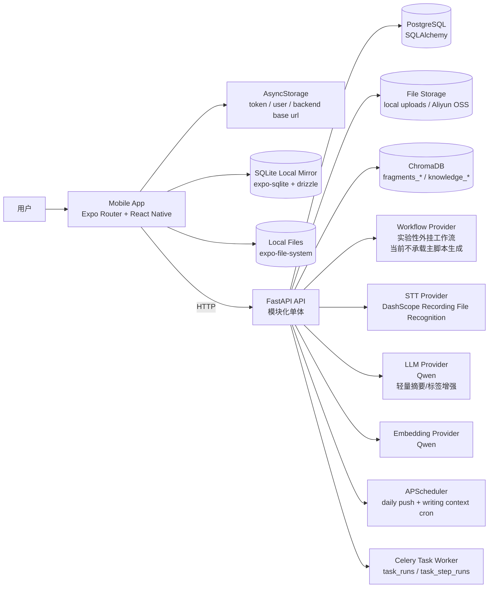
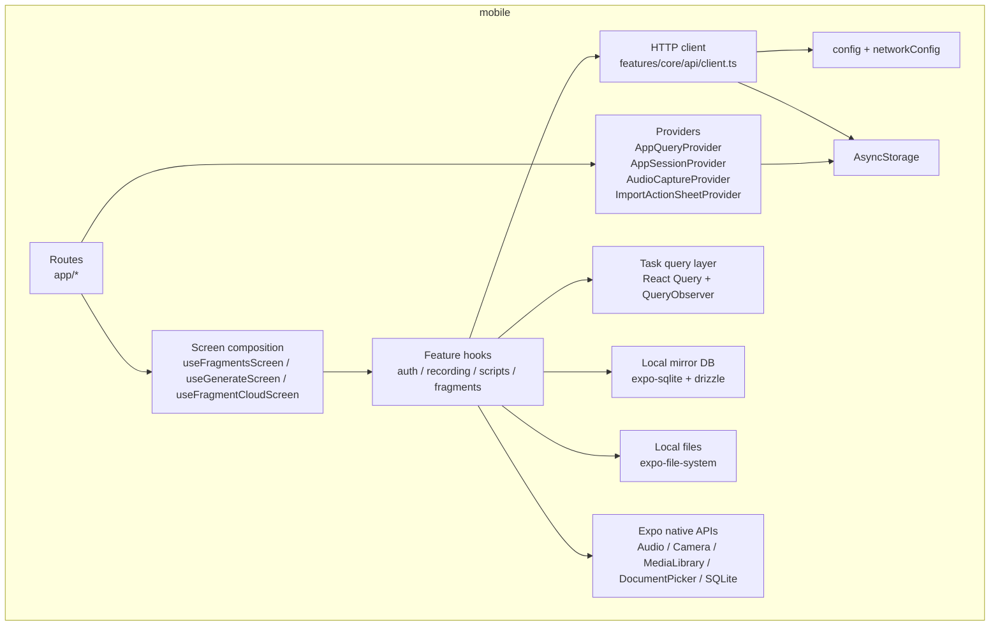
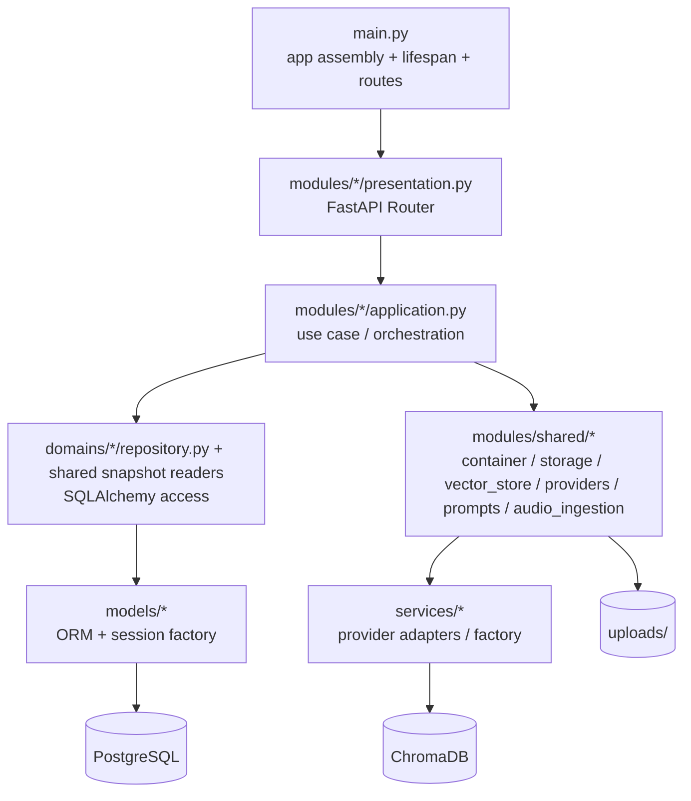
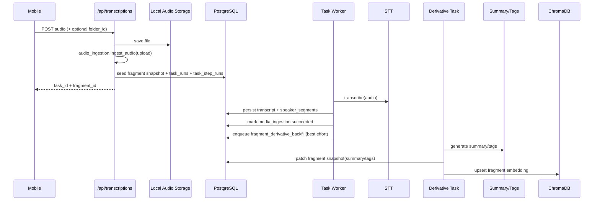
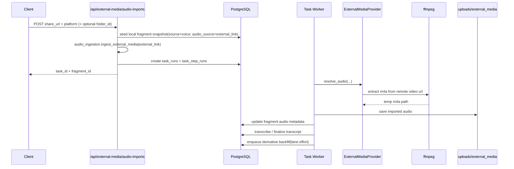
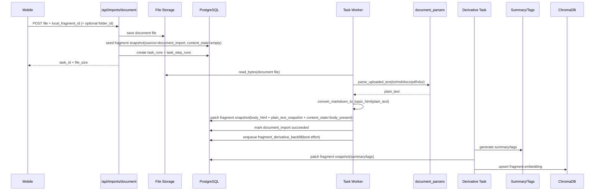
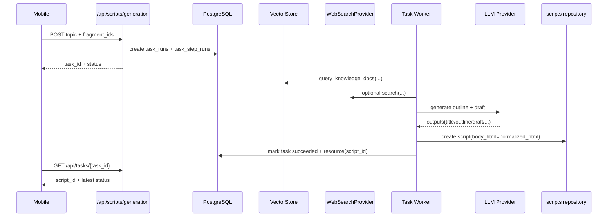
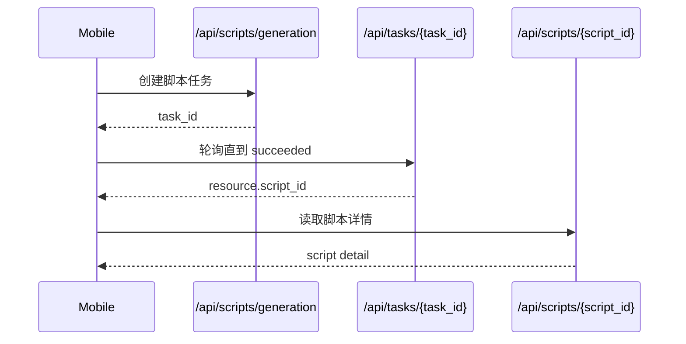
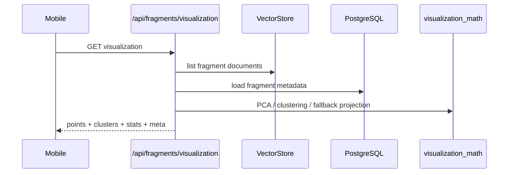
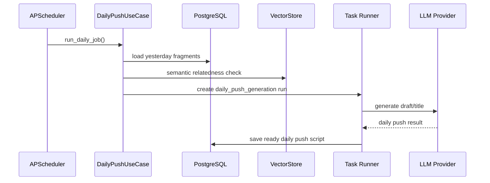

# SparkFlow Architecture

> 最后更新：2026-04-20

本文档描述当前仓库已经落地的实际架构，而不是早期规划版本。SparkFlow 目前是一个 Expo / React Native 移动端应用，配合 FastAPI 模块化单体后端运行，后端本地开发默认数据库已切换为本机 PostgreSQL 服务。

## 0. 今日进展（2026-04-01）

- 后端现已补齐一套阿里云单机部署口径：Ubuntu ECS 上通过 `systemd + nginx` 启动 FastAPI，同机承载 PostgreSQL、Chroma 和本地 uploads，并把 `/api/*`、`/uploads/*` 挂到同域名下；发布默认走 `ssh aliyun + rsync + 外置 backend.env`。
- 仓库本轮补齐了 `development / production` 双层配置入口：后端通过 `APP_ENV + .env/.env.<env>` 装配，移动端通过 Expo runtime config 下发 `appEnv / defaultApiBaseUrl / enableDeveloperTools`。
- 正式移动包现在默认移除 `网络设置 / API 测试 / 错误日志` 等开发入口；即使深链直达调试页，也只会显示拒绝态而不会暴露调试动作。
- `fragments / folders` 的 phase 1 local-first 主链路已经落地：移动端本地 SQLite + `body.html` 为真值，远端只承担自动备份与显式恢复。
- 后端已经补齐 `backups` 模块、`device session` 单设备在线约束，以及面向本地快照的转写 / 外链导入 / 脚本生成请求入口。
- `media_ingestion` 已改成 transcript-first：上传录音和外链导入都会在 transcript 落库后立刻结束主任务，摘要 / 标签 / 向量由单独的 `fragment_derivative_backfill` 任务异步回填。
- 向量检索链路已补齐对当前 Chroma 版本差异的适配：`list_collections()` 返回字符串集合名时，namespace 检查、相似检索和文档枚举都按同一适配层处理。
- 移动端已经补齐 backup queue、显式恢复、本地媒体缓存重建、音频 `object_key` 持久化与恢复链路。
- `scripts` 本轮也切入 local-first：脚本生成成功后会立即落本地 SQLite + `body.html` 文件，后续详情编辑、回收站、恢复冲突副本与拍摄状态都以本地为真值；后端 `scripts` 表只保留生成初稿、任务详情和服务端流程状态，不再反向覆盖本地正文。
- `daily_push` 已切到“后端定时 + 备份快照输入”模式：调度器与手动补跑都从 `backup_records` 中读取 fragment snapshot，再交给 `daily_push_generation` 任务生成脚本，不再把历史 `fragments` 表当作推盘输入真值。
- 后端本轮已经正式下线 `fragments / fragment_tags / fragment_blocks` 旧投影表：标签聚合、导出、文件夹计数、录音导入和外链导入全部改为直接读写 `backup_records` 中的 fragment snapshot。
- `transcriptions` 与 `external_media` 现在都要求客户端先创建本地 placeholder，并显式传入 `local_fragment_id`；后端不再兜底创建远端 fragment 业务记录。
- 服务端生成字段现在直接补写回 fragment snapshot：`transcript`、`speaker_segments`、`summary`、`tags`、`audio_object_key` 及音频访问地址都会写入 `backup_records`，但不会覆盖客户端拥有的 `body_html / plain_text_snapshot / folder_id / content_state / is_filmed`。
- `knowledge` 后端本轮补齐了文本型知识 ingestion：`txt/docx/pdf/xlsx` 统一走 `parsers -> chunking -> indexing -> application` 四层，默认仍写入 Chroma，但对上已通过独立知识索引接口解耦，后续可替换为 LightRAG 等底层引擎。
- `document_import` 后端新增文档导入碎片能力：`txt/md/docx/pdf/xlsx` 文件上传后通过 `document_import` 任务异步解析为纯文本，转为 HTML 写入 fragment snapshot 的 `body_html`，随后自动触发 `fragment_derivative_backfill` 补齐摘要、标签和向量。文档解析逻辑已从知识库 `parsers.py` 提升为共享模块 `modules/shared/content/document_parsers.py`，供知识库与文档导入复用。
- 脚本生成三层上下文本轮调整为“预置稳定内核 + 缓存方法论 + 实时相关素材召回”：稳定内核当前不再按用户素材动态生成，碎片方法论改由每日后台维护任务在阈值达标后静默刷新。
- `fragment` 与 `script` 继续保持独立领域边界：前者是素材池，后者是派生成稿；两者只共享正文协议、编辑器底座、媒体/导出/校验能力，不共享生命周期语义。
- 仓库本轮也完成了一次大规模命名清理：项目仍处于开发期且没有老用户，移动端旧本地库、旧备份 payload 和旧 remote-first 投影不再保留升级路径，字段直接使用当前领域语义。
- 这意味着后续新增实现默认应直接接入 local-first 实体、`backup_status / entity_version` 与 `/api/backups/*`；除第三方版本或运行环境适配外，不再新增历史升级命名。
- 移动端 `fragment / script / folder` 的异步读取已统一收口到 React Query：查询 key 绑定 `user_id + session_version + workspace_epoch`，queryFn 直接读取本地 SQLite / 文件系统；`Zustand` 只保留 UI / session 运行态，不再承载实体列表或详情缓存。
- 移动端 UI 样式约定现已收口到 NativeWind 默认：`tailwind-tokens` 是主题真值，`Themed/Colors` 旧层已移除，`useAppTheme()` 仅保留给富文本编辑器、录音/拍摄、复杂动画和第三方样式桥接场景。
- `modules/shared/content/document_parsers.py` 现已完全依赖 `python-docx`、`pypdf`、`openpyxl` 解析 `txt/md/docx/pdf/xlsx`，不再保留 PDF/XLSX 的手写 fallback 解析路径。

## 1. Overall

## 2. Repository Shape

- `mobile/`: Expo 移动端，当前采用 stack 路由，不是 tab 路由。
- `backend/`: FastAPI 后端，业务入口已经收敛到 `modules/*`。
- `scripts/dev-mobile.sh`: 推荐本地联调入口，同时启动后端与 Expo。
- `scripts/postgres-local.sh`: 本机 PostgreSQL 服务检查与默认库初始化脚本，默认负责补齐 `sparkflow` / `sparkflow_test`。
- `scripts/dify-local.sh`: 本地自托管 Dify 启停脚本，当前主要保留给实验性外挂工作流联调。
- `memory-bank/`: 产品、架构、进度与实施记录。

## 3. Mobile Architecture

### 3.1 Routing

移动端路由位于 `mobile/app/`，由 [`mobile/app/_layout.tsx`](/Users/hujiahui/Desktop/VibeCoding/SparkFlow/mobile/app/_layout.tsx) 统一挂载 `Stack`。

当前主要页面：

- `index.tsx`: 当前实际首页，展示文件夹列表与系统入口；当前系统区包含“全部”和按需出现的“成稿”，碎片列表主视图下沉到 `folder/[id].tsx`。
- `record-audio.tsx`: 录音与上传页。
- `text-note.tsx`: 手动文本碎片创建入口页；进入后会直接创建本地 fragment 实体并立即挂载碎片详情编辑器，不再先走远端建单。
- `fragment/[id].tsx`: 单条碎片详情。
- `fragment-cloud.tsx`: 灵感云图。
- `generate.tsx`: AI 编导生成确认页。
- `import-link.tsx`: 抖音分享链接导入页。
- `script/[id].tsx`: 口播稿详情。
- `scripts.tsx`: 口播稿列表。
- `shoot.tsx`: 提词器 + 相机拍摄。
- `profile.tsx`: 创作工作台。
- `knowledge.tsx`: 知识库占位页，当前还不是完整管理入口。
- `network-settings.tsx`: 后端地址配置页。

### 3.2 Runtime Layers

### 3.3 Mobile Responsibilities

- `AppSessionProvider` 在应用启动时完成后端地址初始化、token 恢复与正式登录态校验；未登录时只进入认证页，不再自动补测试用户。
- `AppQueryProvider` 在根布局挂载 React Query，并把原生 `AppState` 映射到 query focus，统一承接任务态轮询的前后台暂停/恢复。
- `AppSessionProvider` 现在会在工作区挂载、前后台切换和定时保活时同时补跑 backup queue 与任务恢复；页面发起的导入 / 脚本任务也会立刻 handoff 给工作区恢复层，避免离开当前页面后丢失本地回写。
- `AudioCaptureProvider` 承载录音状态、上传状态与录音文件回放能力。
- `ImportActionSheetProvider` 承载底部 `+` 导入抽屉开关与当前文件夹上下文。
- `features/core/api/client.ts` 统一处理 token 注入、错误解析与基础请求方法。
- `features/tasks/taskQuery.ts` 统一提供 `useTaskRunQuery`、`useTaskRunTerminalConsumer`、QueryObserver 轮询和任务 UI phase 映射；task query key 现在绑定 `user_id + session_version + workspace_epoch + task_id`，避免不同会话复用旧缓存。
- `features/core/query/workspace.ts` 统一提供工作区隔离 query scope 与 query key 组装；`features/fragments/queries.ts`、`features/scripts/queries.ts`、`features/folders/queries.ts` 负责 list/detail 查询、局部写回和统一 invalidation。
- `features/tasks/taskRecoveryRegistry.ts` 负责后台任务恢复 observer 的作用域键与去重注册表，供工作区恢复和页面 handoff 共用。
- `utils/networkConfig.ts` 负责后端地址持久化与真机局域网地址切换。
- `features/editor/*` 提供共享正文编辑底座：`contentBodyService` 负责 DOM 级 HTML 解析、标题/预览提取和 asset 引用收集，`html.ts` 保留格式化与桥接 helper，fragment 与 script 详情统一复用这套协议，但不合并成统一业务实体。
- `features/recording/components/*` 负责录音页的 UI 壳层、按钮组与样式，路由文件只保留参数接入与页面装配。
- `features/editor/useEditorSession.ts` 当前只负责组装共享正文会话协议；hydration、保存生命周期、图片插入和运行时 ref 同步已经拆到内部 helper / 子 hook，避免 fragment 与 script 两端继续往主 hook 堆副作用。
- `features/fragments/*` 负责碎片列表、多选、云图和详情相关状态；首页与文件夹页现在共用同一套 list screen model、日期分组规则和选择/生成跳转逻辑。
- `features/fragments/store/*` 现在只承接 fragment 的 **local-first 真值写入与运行时初始化**：主链路集中在 `localEntityStore`、`runtime` 与共享 update helpers；list/detail 主读取改由 `features/fragments/queries.ts` 通过 React Query 统一承接。
- `features/core/db/schema.ts` 只描述当前本地表结构；媒体备份键使用 `backup_object_key`，编辑器保存态使用 `save_state`，待落盘正文使用 `pending_body_html`。
- `features/core/files/*` 当前已把工作区路径约束与文件读写/staging helper 拆开，避免单个 runtime 文件继续膨胀。
- `features/fragments/detail/*` 保留 `resource / 编辑会话 / sheet / screen actions` 四层，但资源层已经改成优先读取本地实体，不再把远端详情当作首屏真值。
- `features/fragments/components/detailSheet/*` 现在承接碎片更多抽屉的 section 组合与只读展示逻辑；内部已进一步拆成 primitives / section blocks / styles，`detail/fragmentDetailSheetState.ts` 负责 related scripts 计数和抽屉载荷组装，避免 `useFragmentDetailScreen` 同时维护 UI 拼装与页面动作。
- `features/imports/*` 负责外部链接导入请求与任务态辅助逻辑。
- `features/scripts/*` 负责口播稿生成、列表、详情状态和每日推盘 API 调用；其中 `features/scripts/store/*` 只承接 script 的 **local-first 真值写入**，list/detail 读取与 invalidation 统一收口到 `features/scripts/queries.ts`，`detail/*` 通过共享 editor 底座实现本地正文编辑、来源碎片抽屉与拍摄跳转。
- `components/layout/*` 当前补齐了 `NotesListScreenShell / NotesListHero / NotesScreenStateView`，首页、文件夹页、成稿页统一复用同一层 notes 风格列表壳层；页面本身只保留各自的数据源、交互和导航逻辑。
- `tailwind.config.js` / `global.css` 是移动端默认 UI 样式入口；常规页面与常规组件统一使用 NativeWind `className` 和 Tailwind token，复杂动画、富文本编辑器、录音、拍摄等高交互区域可继续保留 `StyleSheet`。

### 3.4 Local Persistence

当前移动端真正参与主流程的数据持久化是：

- `AsyncStorage`: token、用户信息、后端 base URL、`device_id` 与少量调试配置
- `expo-sqlite + drizzle-orm`: fragments / folders / media_assets / scripts 的本地真值、备份状态和实体版本
- `expo-file-system`: fragment / script `body.html`、图片/音频 staging 文件

当前移动端 fragments / folders / scripts 主流程采用**local-first 架构**：
- **设备本地 SQLite + 文件系统是当前阶段的真值来源**
- React Query 是 `fragment / folder / script / task` 的统一异步读取层；query key 显式绑定 `user_id + session_version + workspace_epoch`，实体变更后统一通过 invalidation 触发重读本地真值
- 远端只负责自动备份与显式恢复，不再承担 fragments / folders / scripts 的主读取路径
- 编辑与删除先更新本地实体，再由 backup queue 批量推送快照和 tombstone
- AI 生成、转写、外链导入继续走后端，但输入来自客户端上传的本地快照或媒体文件；手动脚本生成发起前会先显式执行一次 `flushBackupQueue()`，确保后端读取到最新已同步 fragment snapshot；script 生成成功后会立刻回写本地 script 真值
- 移动端脚本列表只读取本地 SQLite；脚本生成或任务恢复成功后，可按 `script_id` 拉取详情并落成本地真值。
- 单设备在线由 `device session` 约束；旧设备失效后仍可离线读写本地，但不能继续备份或调用远端 AI
- 显式恢复入口当前挂在 `profile.tsx`，执行时会拉取 `/api/backups/snapshot` 并重建本地 SQLite 与 fragment / script `body.html`，同时最佳努力回填音频/图片本地缓存
- 对于带 `backup_object_key` 的媒体资源，恢复前会额外调用 `/api/backups/assets/access` 刷新最新访问地址，再尝试下载到本地缓存
- fragment 自身音频也会把 `audio_object_key` 存进本地 SQLite 与备份快照，恢复时走同一条地址刷新与本地缓存重建链路
- script 恢复遵循“现存本地 > 远端快照 > 回收站”优先级：已有本地稿不会被远端覆盖，冲突恢复为本地副本并自动追加标题后缀
- `fragment` 与 `script` 都可以进入拍摄页；拍摄完成后只记录本地 `is_filmed / filmed_at`，列表默认不展示徽标，更多用于详情和筛选
- `script.source_fragment_ids` 只表示首次生成来源，script 不会重新进入 fragment 检索、聚类、每日推盘选材或下一轮脚本生成输入
- 移动端在收到“设备会话已失效”后会停止自动补 token，转入本地只读态，并要求用户在 `profile.tsx` 显式重新连接当前设备
- 录音上传、外链导入、脚本生成、备份队列冲刷和显式恢复现在都绑定统一 `TaskExecutionScope(user_id + session_version + workspace_epoch)`；一旦账号切换、登出或会话失效，飞行中的旧任务会停止回写当前工作区，并留在原工作区等待下次恢复
- `scripts` 额外维护了按工作区隔离的 pending task 注册表；App 启动并挂载工作区后，以及后续前后台切换 / 定时保活时，都会重查本地待完成任务并按 `task_id` 继续恢复；fragment 媒体导入任务当前统一使用 `media_task_*` 本地字段承接 run_id、状态与错误信息

### 3.5 Backup Snapshot And File Sync

当前 local-first 内容层的备份/同步语义需要明确区分“本地真值”“远端快照”和“后端投影表”：

- `fragment / folder / media_asset / script` 的真值仍然在移动端本地 SQLite + 文件系统
- 后端 `scripts` 业务表对于移动端 script 来说属于生成初稿、任务详情和服务端流程状态，而不是编辑后的主真值；脚本编辑后的最新正文应通过 `backup_records` 镜像到服务端
- 服务端 `backup_records` 保存的是**按实体粒度**的最新 snapshot，而不是“某个时刻包含所有实体的大快照文件”
- 一次 `flushBackupQueue()` 可以批量上传很多实体，但每个 item 仍只对应一条实体 snapshot；服务端按 `user_id + entity_type + entity_id` 覆盖为该实体当前最新版本
- 这意味着 snapshot 的职责是“让服务端理解截至当前已同步成功的前端真值”，而不是替代本地真值本身

当前 snapshot 生成与上传流程如下：

- 本地创建或更新 fragment / folder / media_asset / script 时，会先更新 SQLite 行与正文/素材文件，并把该实体标记为 `backup_status=pending`
- 只有在真实业务字段变化时才推进 `updated_at` 和 `entity_version`；纯展示态或无效 patch 不会制造新版本
- backup queue 只扫描 `backup_status=pending|failed` 的实体，并在上传时现读本地 SQLite 字段、`body.html` 文件与媒体句柄，临时组装为 `BackupMutationItem`
- 因此“snapshot”更准确地说是“实体当前本地版本在上传瞬间的结构化序列化结果”，不是本地额外长期维护的一份全量镜像文件

当前上传触发机制位于 `AppSessionProvider` 与 backup queue：

- 应用启动完成后会主动执行一次工作区 maintenance，同时补跑 `flushBackupQueue()` 与 `recoverWorkspaceTaskState()`
- AppState 切到 `active` 或 `background` 时会再次执行同一套 maintenance，避免正文、媒体和待完成任务长期只停留在本地
- 前台运行期间每 5 分钟会定时重试一次 maintenance，补充前后台切换未覆盖到的场景
- 当前编辑成功后默认只是把实体留在 `pending`，不会在每次输入后立刻发起网络请求；上传仍以队列批量冲刷为主
- 唯一的主路径例外是手动脚本生成：客户端会在调用 `POST /api/scripts/generation` 前先主动执行一次 `flushBackupQueue()`，用来建立“生成基于最新已同步正文”的 freshness barrier

文件存储当前分两层：

- 小型结构化元数据和内容索引进入 SQLite / `backup_records`
- fragment / script 正文 HTML 以及图片、音频 staging 文件保存在本地文件系统；大对象上传时走 `/api/backups/assets`
- 服务端文件存储统一通过对象存储抽象接入，本地开发使用 `FILE_STORAGE_PROVIDER=local` 写入 `backend/uploads/`，线上按私有 OSS + 签名 URL 设计
- 恢复时，移动端先拉 `/api/backups/snapshot` 重建本地实体，再用 `/api/backups/assets/access` 刷新 `object_key` 的最新访问地址，最后尽力把媒体重新下载回 app sandbox

后端消费 snapshot 的规则也需要单独强调：

- 后端如果要理解前端真值，读取到的永远是“**截止当前时刻，已经成功上传到服务端**”的 snapshot
- 还停留在设备本地、尚未 flush 成功、或上传失败的改动，对后端都是不可见的
- 因此 snapshot-driven 后端能力的语义是“基于最近已同步真值运行”，不是“基于设备瞬时最新状态运行”
- 每日推盘已经按这套方式落地：调度器和手动补跑都从 `backup_records` 提取 fragment snapshot，再交给 `daily_push_generation` 任务生成脚本，不再把历史 `fragments` 表当作输入真值

当前推荐的后端分层口径是：

- 本地 SQLite + 文件系统：前端真值
- `backup_records` snapshot：服务端读取前端真值的标准入口
- `scripts` 等后端业务表：面向生成初稿、任务详情和执行流程；`fragment` 已不再保留独立业务投影表

## 4. Backend Architecture

### 4.1 Layers

后端代码位于 `backend/`，已演进为模块化单体结构。

### 4.2 Actual Boundaries

- `backend/main.py`: 创建 FastAPI app、注册 request-id 中间件、异常处理器、静态文件、路由和 scheduler 生命周期。
- `backend/modules/*/presentation.py`: 对外 HTTP 入口。
- `backend/modules/*/schemas.py`: 当前模块自有的 API request/response DTO，避免跨目录重复定义 contract。
- `backend/modules/*/application.py`: 业务编排与用例。
- `backend/domains/*/repository.py`: 针对 PostgreSQL 聚合的仓储层，只负责 SQLAlchemy 数据访问。
- `backend/modules/shared/fragment_snapshots.py` / `backend/modules/shared/media_asset_snapshots.py`: 基于 `backup_records` 的 snapshot 读取入口，负责把服务端已同步快照还原成可消费 DTO。
- `backend/models/*`: ORM 模型、数据库 engine、session 工厂。

当前约定：

- 模块内 `schemas.py` 是后端 API contract 的单一事实源。
- `presentation.py` 应显式声明 `response_model=ResponseModel[...]`，让 OpenAPI 可直接作为前后端并行开发的契约。
- 删除接口统一返回 `200 + ResponseModel[None]`，成功时 `data` 为 `null`。
- `backend/modules/shared/ports.py`: LLM、STT、Embedding、Vector DB、音频存储、外挂工作流等端口抽象。
- `backend/modules/shared/enrichment.py`: 摘要与标签增强逻辑。
- `backend/modules/shared/warning_throttle.py`: 告警限流工具。
- `backend/modules/shared/infrastructure/container.py`: DI 容器入口，只负责 `ServiceContainer`、默认依赖装配和 FastAPI 依赖读取。
- `backend/modules/shared/infrastructure/infrastructure.py`: 聚合导出入口，统一转发 `storage` / `vector_store` / `providers`，避免调用方散落到多个基础设施文件。
- `backend/modules/shared/infrastructure/storage.py`: 本地 / OSS 文件存储实现、对象 key 规则与上传校验。
- `backend/modules/shared/infrastructure/vector_store.py`: 应用级向量存储适配与 namespace 规则。
- `backend/services/chroma_vector_db.py`: Chroma 持久化实现，适配不同版本 `list_collections()` 返回的集合名结构。
- `backend/modules/shared/infrastructure/providers.py`: 外部媒体、网页搜索与 workflow provider 的默认工厂。
- `backend/modules/shared/media/audio_ingestion.py`: 媒体导入统一入口，负责把外部调用收口到当前 use case。
- `backend/modules/shared/media/audio_ingestion_use_case.py`: 媒体导入任务创建入口，负责 fragment 初始化、入队与前置校验。
- `backend/modules/shared/media/media_ingestion_steps.py`: 媒体导入任务的步骤执行器，当前只负责解析/下载、STT、transcript 落库与主任务终态。
- `backend/modules/shared/media/media_ingestion_persistence.py`: 媒体导入链路的音频元数据回写、转写落库与终态输出组装。
- `backend/modules/shared/media/stored_file_payloads.py`: `StoredFile` 与任务 payload 的互转 helper。
- `backend/modules/shared/tasks/runtime.py`：Celery 任务运行时，负责步骤定义、首步入队、自动重试与恢复。
- `backend/modules/shared/celery/*`：Celery app、步骤投递、队列路由与 beat 任务装配。
- `backend/modules/fragments/derivative_task.py`: fragment 摘要、标签和向量异步回填任务。
- `backend/modules/shared/content/`: 正文处理子目录，包含 `body_service.py`、`content_markdown.py`、`content_schemas.py`、`editor_document.py`、`fragment_body_markdown.py`、`document_parsers.py`（共享文档解析器，支持 txt/md/docx/pdf/xlsx）。
- `backend/services/*`: 当前主要保留外部 provider 实现与工厂；新增业务逻辑应优先进入 `modules/*` 或 `modules/shared/*`，不要继续扩散到早期 service 层。

当前 `fragments` 模块内部进一步拆分为：

- `application.py`: 基于 snapshot 的查询、标签聚合和详情导出入口。
- `mapper.py`: 碎片与媒体资源响应映射。
- `content.py`: fragment 正文 HTML / Markdown / 纯文本快照 helper。
- `derivative_service.py`: 摘要 / 标签刷新和向量同步。
- `visualization.py`: 碎片云图布局和相似度可视化结果组装。

当前 `scripts` 模块内部进一步拆分为：

- `application.py`: 脚本查询、写操作与每日推盘编排入口。
- `rag_task.py`: `rag_script_generation` 任务步骤定义与协调。
- `daily_push_task.py`: `daily_push_generation` 任务步骤定义与结果回流。
- `writing_context_builder.py`: 三层写作上下文构建与方法论缓存维护。
- `rag_context_builder.py`: 最终生成提示词拼装。
- `persistence.py`: workflow 输出解析、失败消息提取、脚本幂等落库。
- `daily_push.py`: 每日推盘的碎片文本拼接与相似度筛选规则。

### 4.3 Backend Folder Map

- `backend/core/`: 配置、认证、统一响应模型、异常体系和结构化日志配置。
- `backend/constants/`: 共享常量定义。
- `backend/utils/`: 时间、序列化等通用工具。
- `backend/modules/`: 当前后端主业务入口，按业务模块拆分。
- `backend/modules/shared/`: 多模块共享端口、容器和公共能力，不单独对外暴露业务路由。
- `backend/domains/`: 仅保留当前仍在使用的仓储目录；历史空壳 package 已移除，避免误导为仍有对应 repository。
- `backend/models/`: SQLAlchemy ORM 模型和数据库初始化。
- `backend/services/`: 外部 provider 的适配实现和实例工厂。
- `backend/prompts/`: 后端 prompt 文本与模板目录；脚本生成、知识处理、标签增强和健康检查等提示词统一从这里读取。
- `backend/alembic/`: 数据库迁移脚本。
- `backend/tests/`: 后端自动化测试。
- `backend/uploads/`: `local` 文件存储 provider 的对象根目录（运行时生成，不纳入版本控制）。
- `backend/chroma_data/`: 本地向量库持久化目录（运行时生成，不纳入版本控制）。
- `backend/runtime_logs/`: 运行时日志目录，当前包含后端全量日志、错误日志和移动端错误日志落盘文件。
- `backend/scripts/`: 后端辅助脚本。
- 本地路径类配置（如 `UPLOAD_DIR` / `CHROMADB_PATH` / `RUNTIME_LOG_DIR`）即使在 `.env` 中写相对路径，也统一按 `backend/` 目录解析，避免因为启动 cwd 不同漂移到仓库根目录。

### 4.4 Backend Modules

- `auth`: 测试 token 签发、当前用户信息、refresh。
- 正式认证当前采用邮箱密码登录，JWT 仍携带 `device_id + session_version`，继续保持单设备在线。
- 移动端本地 SQLite、fragment/script 正文文件、音频缓存与 staging 目录都已按 `user_id` 工作区隔离；切换账号时会切换整套本地工作区，而不是共用一份本地真值。
- 本地联调仍可通过 `POST /api/auth/token` 走测试用户 `test-user-001`，但该入口只作为开发调试后门，不能再当作产品主登录流。
- `backups`: 远端备份批量写入、快照拉取、restore session 审计与备份素材上传；不承担 fragments / folders 的日常主读取职责，但脚本生成、相似检索、可视化和 daily push 都会通过内部 snapshot reader 消费其中的 fragment snapshot。
- `fragment_folders`: 碎片文件夹 CRUD、文件夹内碎片数量统计。
- `fragments`: 当前对外只保留标签、相似检索和可视化接口；移动端 phase 1 已不再依赖其作为 fragments / folders 首屏真值读取来源，`transcript` 只保留语音机器转写原文，正式正文统一存于 `body_html`，`plain_text_snapshot` 负责检索、摘要和生成输入。
- `transcriptions`: 音频上传入口；local-first 请求会带 `local_fragment_id`，后端不再先创建远端 fragment 业务记录，主状态入口统一收敛到 `tasks`。
- `external_media`: 外部媒体音频导入，当前支持抖音分享链接；local-first 请求会直接绑定客户端 placeholder fragment，解析链接、下载转 m4a、主转写在 `media_ingestion` 中执行，摘要/标签/向量由后续 derivative task 异步补齐。
- `scripts`: 合稿、脚本生成任务定义、三层写作上下文组装、结果回流、列表、详情、更新、删除、每日推盘；正文在存储层和对外契约中都只保留 `body_html`，导出 Markdown 由后端统一派生。脚本生成主链路里的 fragment 背景、方法论维护和相关碎片召回都已经切到共享 fragment snapshot reader。
- `knowledge`: 文档创建、上传、列表、搜索、详情、删除；对外正文字段继续保留 `body_markdown`，内部 `content` 仅保留派生纯文本索引载荷；模块内部已拆成 `chunking.py`、`indexing.py`、`application.py`，文档解析直接复用 `modules/shared/content/document_parsers.py`。
- `document_import`: 文档导入碎片入口；支持 `.txt/.md/.docx/.pdf/.xlsx` 文件上传，通过 `document_import` task 异步解析文档为纯文本并转为 HTML 写入 fragment snapshot，随后自动触发 `fragment_derivative_backfill` 补齐摘要、标签和向量。调用前客户端需先创建本地占位 fragment 并传入 `local_fragment_id`。
- `media_assets`: 统一媒体资源上传、列表和删除，响应层返回签名文件 URL。
- `exports`: 单条 Markdown 导出与批量 zip 导出。
- `tasks`: 后台任务详情、步骤查询与手动重跑入口。
- `debug_logs`: 移动端调试日志接收，并复用结构化日志链路落盘。
- `scheduler`: APScheduler 装配与启停。

### 4.5 Backend Coding Conventions

- 新增接口时，优先补模块内 `schemas.py`，不要把 request/response model 内联到 `presentation.py`。
- `presentation.py` 只负责 HTTP 适配，不承载核心业务规则。
- `application.py` 负责用例编排、数据校验、错误抛出和 provider 调用。
- repository 仅负责数据读写，不承载流程级业务编排。
- 如需跨模块复用，优先抽到 `modules/shared/`；不要回退到早期全局 schema 组织方式。
- 所有对外接口默认走标准响应包裹 `ResponseModel`，并补中文 `summary` / `description`。
- 注释应简短，只解释非显然业务约束或实现原因。

### 4.6 External Dependencies

- LLM: 默认 `Qwen`，通过 `services/factory.py` 创建，当前仅承担碎片摘要/标签等轻量增强能力。
- STT: 默认 `DashScope` 录音文件识别，支持说话人分离。
- Embedding: 默认 `Qwen text-embedding-v2`。
- Vector DB: 默认 `ChromaDB`。
- Workflow Provider: 当前保留通用 `workflow_provider` 端口与 `DifyWorkflowProvider` 实现，供未来外挂工作流或实验性链路复用；当前主脚本生成链路已经收口到后端 `RagScriptTaskService`。
- Knowledge Index Store: 当前知识库索引通过独立 `knowledge_index_store` 抽象接入；默认实现仍由 `AppVectorStore` 适配 Chroma，未来若切换 LightRAG，目标是只替换这一层。
- 当前脚本生成输入收敛为 `topic` + `fragment_ids`：后端先构建三层写作上下文，再生成 SOP 大纲并拼装草稿。其中：
- `稳定内核层` 当前使用系统预置文案，不再在生成链路里按用户历史碎片或知识库动态生成。
- `方法论层` 由“已缓存的碎片提炼结果 + 上传资料映射条目 + 预置方法模板”组成；碎片提炼改由每日后台维护任务按阈值静默刷新。
- `相关素材层` 负责召回与当前主题相关的历史脚本、碎片和知识文档。
- Dify Local Runtime: 若采用仓库内置脚本自托管，默认通过 `Docker Compose + PostgreSQL profile` 运行，并映射到 `127.0.0.1:18080`。
- Storage: 统一 `FileStorage` 端口；本地开发默认 `local` provider，线上默认私有阿里云 OSS，通过签名 URL 暴露文件访问。
- Database: PostgreSQL（本地开发默认使用本机服务，默认库为 `sparkflow` / `sparkflow_test`）。

### 4.7 Namespaces and Storage Conventions

- 碎片文件夹表：`fragment_folders`
- fragment 服务端真值快照：`backup_records(entity_type='fragment')`
- fragment 标签不再落独立 `fragment_tags` 表，而是保存在 fragment snapshot 的 `tags` 字段中。
- fragment snapshot 内的 `folder_id` 指向真实文件夹；“全部”只是前端系统视图，不落库。
- fragment snapshot 的 `audio_source` 用于区分音频来源；当前取值为 `upload` / `external_link` / `null`
- fragment snapshot 的 `source` 用于区分碎片来源；当前取值为 `voice` / `manual` / `video_parse` / `document_import`
- fragment snapshot 的 `transcript` 保存机器转写原文，`body_html` 保存唯一正式正文的 HTML，`plain_text_snapshot` 保存派生纯文本快照
- 非语音碎片必须直接写入 `body_html`，不再把 `transcript` 当作正式正文来源
- 移动端碎片详情正文改为 `react-native-enriched` 原生富文本输入；前端运行时与本地草稿统一消费 HTML 快照，AI patch 本期停用
- 移动端碎片详情采用**local-first + query-backed resource**：`features/fragments/store/*` 负责本地真值写入，`features/fragments/queries.ts` 负责详情/列表读取与 invalidation；detail resource 只组合当前 query 数据为展示态，远端仅承担备份与恢复
- 详情编辑会话的纯逻辑已下沉到 `editorSessionState.ts`、`bodySessionState.ts` 和 `fragmentSaveController.ts`：`editorSessionState.ts` 负责 session reducer、基线解析、自动保存触发条件与图片 fallback 规则，`bodySessionState.ts` 继续承载 Markdown 快照构建、远端刷新判定、AI fallback patch 和乐观展示态合成，`fragmentSaveController.ts` 保证自动保存只串行提交最后一版快照
- `scripts.body_html` / `knowledge_docs.body_markdown` 分别保存脚本 HTML 正文与知识库 Markdown 正文
- 媒体资源表：`media_assets` / `content_media_links`，对象元数据保存 `storage_provider` / `bucket` / `object_key`
- 碎片向量 namespace: `fragments_{user_id}`
- 知识库向量 namespace: `knowledge_{user_id}`
- 后台任务表：`task_runs` / `task_step_runs`
- 碎片音频对象元数据：`audio_storage_provider` / `audio_bucket` / `audio_object_key`
- 后端业务日志文件: `runtime_logs/backend/backend.log`
- 后端错误业务日志文件: `runtime_logs/backend/backend-error.log`
- HTTP 访问日志文件: `runtime_logs/access/access.log`
- HTTP 访问错误日志文件: `runtime_logs/access/access-error.log`
- 移动端调试日志文件: `runtime_logs/mobile/mobile-debug.log`
- 历史混合日志归档目录: `runtime_logs/legacy/`
- 每日推盘调度时间：使用 `APP_TIMEZONE`，默认 `Asia/Shanghai`，时间点由 `DAILY_PUSH_HOUR` / `DAILY_PUSH_MINUTE` 控制
- 每日写作上下文维护时间：使用 `APP_TIMEZONE`，默认 `Asia/Shanghai`，时间点由 `WRITING_CONTEXT_SCHEDULER_HOUR` / `WRITING_CONTEXT_SCHEDULER_MINUTE` 控制

### 4.8 Logging and Test Baseline

- HTTP 请求入口统一绑定 `request_id`，并通过 `structlog` 输出结构化日志。
- 关键后台链路日志字段至少包含 `event`、`request_id`、`path`、`module`，核心转写链路额外补 `fragment_id`、`user_id`、`provider`、`attempt`。
- 后端主日志会同时输出到控制台，并通过独立 file handler 写入 `runtime_logs/backend/backend.log`。
- 后端 `ERROR` 及以上日志会额外写入 `runtime_logs/backend/backend-error.log`，便于单独排查失败链路。
- HTTP 访问日志与访问失败日志会分流到 `runtime_logs/access/access.log` 和 `runtime_logs/access/access-error.log`，避免任务轮询把业务日志淹没。
- 移动端调试日志通过独立 file handler 写入 `runtime_logs/mobile/mobile-debug.log`，但字段格式与主日志链路保持一致。
- 改造前平铺在 `runtime_logs/` 根目录的旧 `backend*.log*` 会通过维护脚本迁到 `runtime_logs/legacy/`，避免与新结构混用。
- 后端自动化测试已切换到 `pytest`。
- 后端测试现按两层运行：轻量 smoke / contract 测试不依赖 PostgreSQL，依赖数据库或真实应用启动副作用的测试统一标记为 `integration`。
- OpenAPI 契约 smoke 校验通过 `Schemathesis` 直接消费 `/openapi.json`，其中公开无状态端点走轻量基线，认证等依赖数据库的契约单独保留在 integration 测试里。
- 移动端自动化测试当前仍以 Node `--test` 运行的少量状态 helper 为主，不包含完整 UI 渲染基线。

## 5. Core Flows

### 5.1 Audio Upload and Async Transcription

关键点：

- 上传接口立即返回，转写在后台继续执行。
- `media_ingestion` 现在以 transcript 落库为唯一成功条件；主任务成功时 `summary` / `tags` 可以暂时为空。
- transcript 落库后会最佳努力创建内部 `fragment_derivative_backfill` 任务，异步补齐 `summary`、`tags` 与向量。
- derivative 或向量写入失败不会回滚主转写结果。

### 5.2 External Media Audio Import

关键点：

- 当前接口只创建本地 fragment 对应的服务端快照和后台任务，外链解析、下载转码与 transcript 落库在 `media_ingestion` 任务中异步执行，摘要/标签/向量随后异步补齐。
- `folder_id` 为可选字段；若从某个文件夹页发起导入，预创建 fragment 会直接归入该文件夹。
- 对外接口按多平台抽象设计，但 v1 只有抖音 provider。
- 导入文件统一保存到对象存储 `audio/imported/...` 命名空间，输出格式固定为 `m4a`。

### 5.3 Document Import

关键点：

- 文档导入前，客户端必须先创建本地占位 fragment（`content_state=empty`），并传入 `local_fragment_id`。
- 支持格式：`.txt`、`.md`、`.docx`、`.pdf`、`.xlsx`；文件大小上限 20MB。
- 文档文件保存到对象存储 `documents/{user_id}/{fragment_id}/{filename}` 命名空间。
- `document_import` 任务包含 3 个步骤：`parse_document`（解析文件为纯文本）、`write_fragment_body`（纯文本转 HTML 写入 snapshot）、`finalize_import`（触发衍生回填）。
- Markdown 文件的原始文本通过 `convert_markdown_to_basic_html()` 保留标题、列表、引用等结构；其他格式的纯文本按段落包裹 `
` 标签。
- 解析完成后自动触发 `fragment_derivative_backfill`，异步补齐摘要、标签和向量，与音频导入链路的回填行为一致。
- 文档解析逻辑位于 `modules/shared/content/document_parsers.py`，与知识库模块共享；知识库模块的 `parsers.py` 已改为从此共享模块导入。
- PDF / XLSX 解析默认依赖 `pypdf` 与 `openpyxl`，运行时缺失依赖或文件损坏时直接返回统一 `ValidationError`，不再回退到手写解析逻辑。
### 5.4 Script Generation Task

关键点：

- 外挂工作流 provider 只负责远程执行步骤，不直接访问 PostgreSQL、ChromaDB 或业务表。
- fragments、knowledge hits 和可选 web hits 都由 SparkFlow 后端先收集。
- SparkFlow 后端向内部 task runtime 传递稳定内核、方法论、相关素材、SOP 大纲和可选碎片背景；客户端主路径统一消费 `task_id` 和 `/api/tasks/*`。
- `task_runs` / `task_step_runs` 是后台状态唯一事实源；`agent_runs` 与 `/api/agent/*` 已移除。

### 5.5 Script Generation Notes

关键点：

- `POST /api/scripts/generation` 只负责创建任务，不再同步返回 `Script`。
- 客户端应统一经由 `/api/tasks/{task_id}` 读取最终 `script_id`，再跳转脚本详情。
- 当前生成链路使用 `topic` 作为大纲生成和相关素材召回的统一驱动输入；稳定内核当前走系统预置，碎片方法论只读取缓存条目，离线维护任务每日检测碎片总量与增量后决定是否重算。
- 脚本生成任务关键步骤为 `generate_outline`、`retrieve_examples`、`generate_script_draft`、`persist_script`。

### 5.6 Fragment Visualization

关键点：

- 实现位于 `backend/modules/fragments/visualization.py`。
- 首版走轻量 PCA + 聚类，不依赖重型 3D 栈。

### 5.7 Daily Push

关键点：

- scheduler 在 FastAPI lifespan 内启动与停止。
- 手动触发接口已存在：`/api/scripts/daily-push/trigger` 和 `/api/scripts/daily-push/force-trigger`，当前返回异步 `task_id` / `task_type` / `status_query_url`。
- 每日推盘当前和脚本生成一样，统一走后端直连 LLM + task runtime 编排；摘要/标签增强沿用同一组基础 provider。
- 当前后端链路已完成，但首页“每日灵感卡片”还没有稳定接入到实际主页面。

## 6. Current API Surface

当前主要公开 API：

- `GET /`
- `GET /health`
- `POST /api/auth/token`
- `GET /api/auth/me`
- `POST /api/auth/refresh`
- `GET /api/fragments/tags`
- `POST /api/fragments/similar`
- `GET /api/fragments/visualization`
- `GET /api/fragment-folders`
- `POST /api/fragment-folders`
- `PATCH /api/fragment-folders/{folder_id}`
- `DELETE /api/fragment-folders/{folder_id}`
- `POST /api/transcriptions`
- `POST /api/imports/document`
- `POST /api/scripts/generation`
- `GET /api/scripts`
- `GET /api/scripts/daily-push`
- `POST /api/scripts/daily-push/trigger`
- `POST /api/scripts/daily-push/force-trigger`
- `GET /api/scripts/{script_id}`
- `PATCH /api/scripts/{script_id}`
- `DELETE /api/scripts/{script_id}`
- `POST /api/knowledge`
- `POST /api/knowledge/upload`
- `GET /api/knowledge`
- `POST /api/knowledge/search`
- `GET /api/knowledge/{doc_id}`
- `DELETE /api/knowledge/{doc_id}`
- `POST /api/debug/mobile-logs`

## 7. Key Entry Files

- Frontend app entry: `mobile/app/_layout.tsx`
- Frontend home: `mobile/app/index.tsx`
- Session bootstrap: `mobile/providers/AppSessionProvider.tsx`
- Fragment list screen model: `mobile/features/fragments/useFragmentListScreenState.ts`
- Fragment screen model: `mobile/features/fragments/useFragmentsScreen.ts`
- Fragment detail screen model: `mobile/features/fragments/detail/useFragmentDetailScreen.ts`
- Generate screen model: `mobile/features/scripts/useGenerateScreen.ts`
- Fragment cloud model: `mobile/features/fragments/useFragmentCloudScreen.ts`
- Audio state provider: `mobile/features/recording/AudioCaptureProvider.tsx`
- API client: `mobile/features/core/api/client.ts`
- Backend entry: `backend/main.py`
- Service container: `backend/modules/shared/infrastructure/container.py`
- Shared infrastructure: `backend/modules/shared/infrastructure/infrastructure.py`
- Fragments module: `backend/modules/fragments/presentation.py`
- Fragment folders module: `backend/modules/fragment_folders/presentation.py`
- Transcriptions module: `backend/modules/transcriptions/application.py`
- Scripts application: `backend/modules/scripts/application.py`
- Scripts task: `backend/modules/scripts/rag_task.py`
- Scripts context builder: `backend/modules/scripts/rag_context_builder.py`
- Knowledge module: `backend/modules/knowledge/application.py`
- Document import module: `backend/modules/document_import/application.py`
- Shared document parsers: `backend/modules/shared/content/document_parsers.py`
- Scheduler module: `backend/modules/scheduler/application.py`

## 8. Current Architectural Notes

- 代码已经从早期的 `routers + service` 形态迁移到 `modules/*` 主入口；仓库里的 `services/*` 主要作为外部 provider 适配层，不应再把它们当成新的业务层规范。
- 碎片管理现在分为“真实文件夹 + 全部系统视图”两层：文件夹模块负责容器管理；fragment 主写链路已切到客户端 local-first，后端 `fragments` 模块当前主要保留标签聚合和基于 snapshot 的检索/可视化能力。
- `GET /api/fragments/tags` 提供热门 Tag 与模糊建议能力；碎片列表筛选主路径已回到移动端本地 SQLite，不再依赖后端 `GET /api/fragments`。
- Tag 对外仍通过 fragment snapshot 的 `tags` 返回，后端聚合、建议与过滤统一基于 `FragmentSnapshotReader` 扫描已同步快照。
- 移动端当前是“文件夹入口优先”的首页结构，不是 PRD 里最初设想的 tab 首页；碎片列表主视图仍是核心工作区，但入口已经下沉到文件夹页。
- 知识库后端已可用，移动端入口仍是占位页。
- 每日推盘后端已可运行并带有定时任务；当前输入源是服务端已收到的 fragment 备份快照，前端主入口仍需继续收口其消费体验。
- 当前最稳定的本地开发方式是根目录执行 `bash scripts/dev-mobile.sh`，脚本会自动确保本机 PostgreSQL、后端和 Expo 依次就绪。

## 9. Frontend / Backend Collaboration

随着移动端与后端可能由不同成员并行开发，当前仓库默认采用“契约驱动 + 用户流驱动”的协作方式。

### 9.1 Collaboration Defaults

- 需求以用户流拆分，不只按前端页面或后端接口拆分。
- 后端模块内 `schemas.py` 是 API contract 单一事实源。
- `presentation.py` 上声明的 `response_model=ResponseModel[...]` 与 `/docs`、`/redoc` 一起构成前后端联调契约。
- 前端可以基于 contract 先做 mock 和页面状态流，不等待后端完整实现。
- 项目当前仍处于无老用户开发期，允许随前后端同步做破坏性契约调整；变更必须提前对齐并同步更新文档与测试。

### 9.2 Expected Workflow

1. 先明确用户流与验收标准。
2. 后端先定义最小 request / response contract。
3. 前端按 contract 完成页面、loading、empty、error 和 mock。
4. 后端补齐真实业务实现、测试和响应样例。
5. 双方通过 `bash scripts/dev-mobile.sh` 做本地联调。
6. 合并前同步更新 README / architecture / API 示例。

### 9.3 Current Coordination Rules

- 新接口优先新增或更新模块内 `schemas.py`，不要只在聊天里约定字段。
- 涉及状态流转的接口，联调时必须覆盖“处理中 / 成功 / 失败”三个方向。
- 联调问题优先结合 `backend/runtime_logs/mobile/mobile-debug.log` 与 `backend/runtime_logs/access/access.log` 排查，而不是只看前端截图。
- 启动方式、环境假设或模块边界发生变化时，文档必须与代码同一轮更新。

更完整的执行细则见 [`memory-bank/frontend-backend-collaboration.md`](/Users/hujiahui/Desktop/VibeCoding/SparkFlow/memory-bank/frontend-backend-collaboration.md)。
