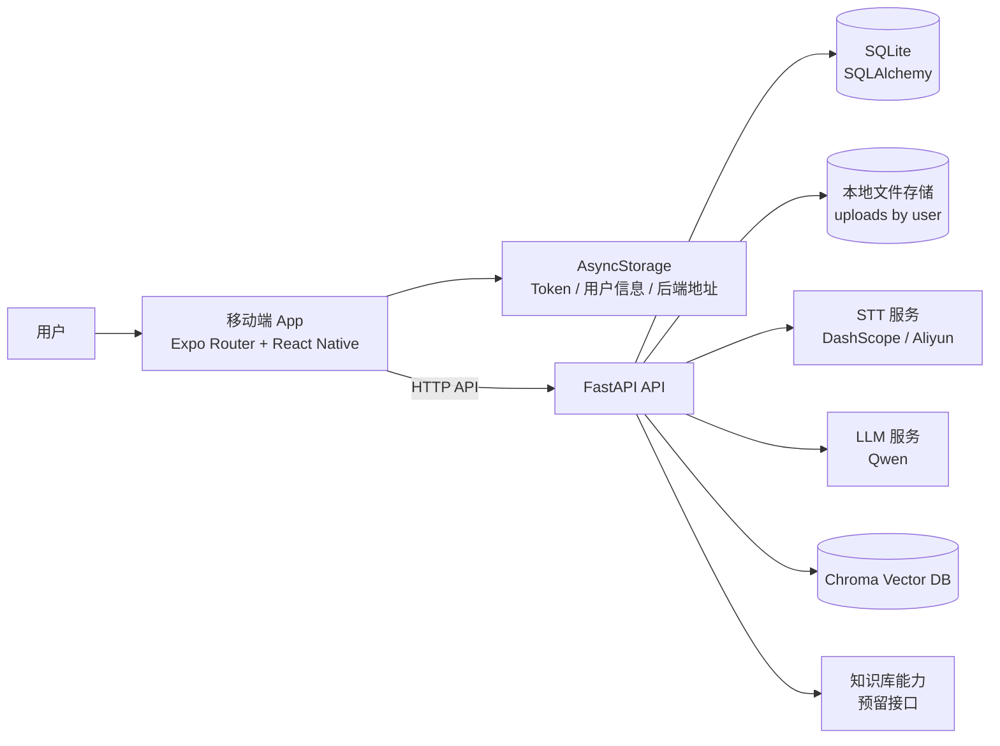
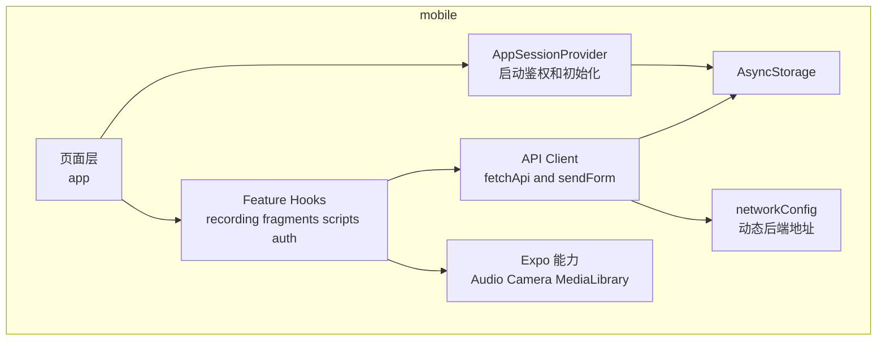
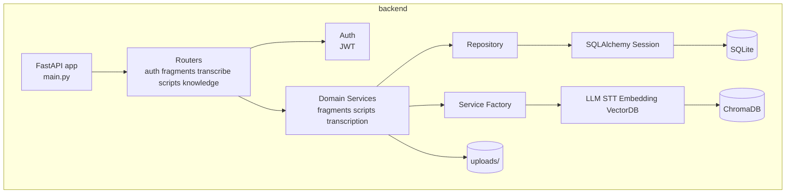
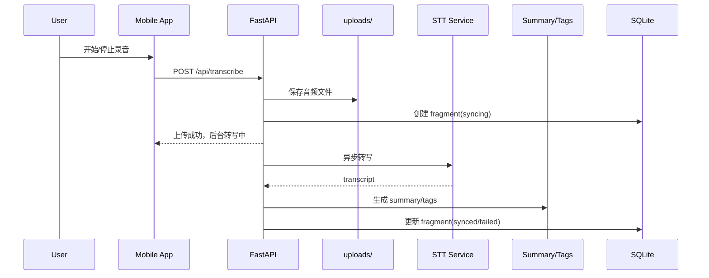
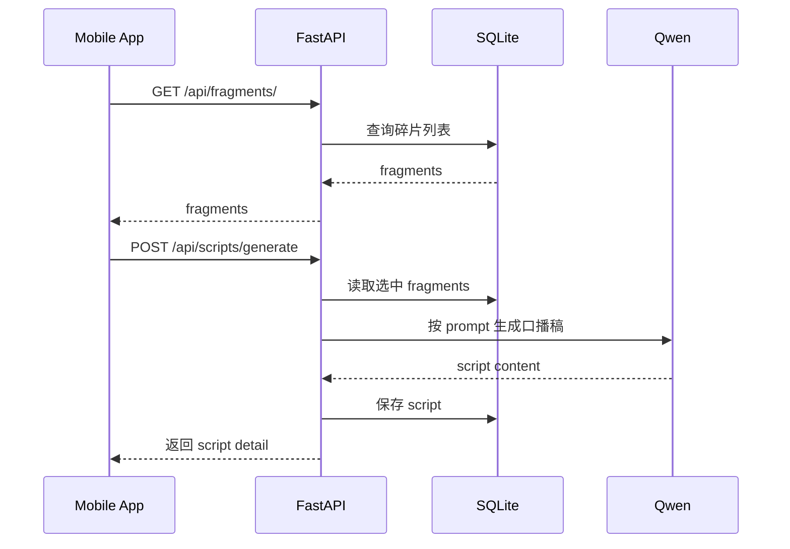

# SparkFlow Architecture

本文档描述 SparkFlow 当前代码实现对应的前后端架构。当前项目形态是 Expo/React Native 移动端应用配合 FastAPI 后端服务，不是传统浏览器 Web 前端。

## 1. Overall

## 2. Frontend Architecture

移动端代码位于 `mobile/`，以 Expo Router 组织页面，以 feature hooks + API client 组织业务调用。

### 2.1 Frontend Layers

- `mobile/app/`: 页面与路由入口，负责导航和页面编排。
- `mobile/providers/`: 会话初始化、全局状态挂载。
- `mobile/features/*/hooks.ts`: 页面调用的业务 hooks，管理 loading、error、提交动作。
- `mobile/features/*/api.ts`: 面向具体业务的 API 封装。
- `mobile/features/core/api/client.ts`: HTTP 基础设施，负责 token、重试、统一错误处理。
- `mobile/constants/config.ts` + `mobile/utils/networkConfig.ts`: 后端地址管理。
- `mobile/components/`: 通用 UI 组件。

### 2.2 Frontend Initialization

应用启动后，`AppSessionProvider` 会完成以下初始化流程：

1. 初始化后端地址配置。
2. 从 `AsyncStorage` 读取 token 和用户信息。
3. 如果没有 token，则调用 `/api/auth/token` 获取测试用户 JWT。
4. 将会话状态注入页面树。

## 3. Backend Architecture

后端代码位于 `backend/`，以 FastAPI 路由层、domain service 层、repository 层、外部服务适配层分层组织。

### 3.1 Backend Layers

- `backend/main.py`: FastAPI 应用入口，注册路由、中间件、异常处理、健康检查。
- `backend/routers/`: API 路由层，处理请求参数、鉴权依赖、响应格式。
- `backend/domains/`: 领域服务层，承载核心业务逻辑。
- `backend/domains/*/repository.py`: 数据访问层，封装 ORM 查询和持久化。
- `backend/services/`: 外部能力适配层和工厂层，封装 LLM、STT、Embedding、Vector DB。
- `backend/models/`: SQLAlchemy 模型、引擎、Session 管理。
- `backend/prompts/`: AI 合稿 Prompt 模板。

### 3.2 Backend Service Boundaries

- 认证：JWT 鉴权，当前默认使用测试用户 token。
- 碎片：碎片 CRUD、转写状态查询。
- 转写：上传音频、创建 fragment、异步调用 STT、回写 transcript/summary/tags。
- 口播稿：读取已转写 fragments，拼接 prompt，调用 LLM 生成 script。
- 知识库：接口已注册，当前未接入主创作链路。

### 3.3 Data and External Dependencies

- 主数据库：SQLite。
- ORM：SQLAlchemy。
- 音频存储：本地文件系统 `uploads/{user_id}/`。
- LLM：当前通过 `services/factory.py` 统一创建，默认 Qwen。
- STT：当前支持 DashScope 或 Aliyun。
- 向量库：当前默认 ChromaDB，本地持久化。

## 4. Core Business Flows

### 4.1 Audio Recording and Transcription

说明：

- 前端录音依赖 Expo Audio。
- 上传成功后，接口立即返回，转写在后台异步执行。
- 转写成功后会补充 `transcript`、`summary`、`tags`。
- 转写失败则 fragment 标记为 `failed`。

### 4.2 Script Generation

说明：

- 只有存在有效转写内容的 fragments 才能参与合稿。
- 合稿模式由前端传入：`mode_a` 或 `mode_b`。
- Prompt 模板位于 `backend/prompts/`。

## 5. Request Path Mapping

典型调用路径如下：

- 页面层 `mobile/app/*`
- hooks 层 `mobile/features/*/hooks.ts`
- API 封装层 `mobile/features/*/api.ts`
- HTTP Client `mobile/features/core/api/client.ts`
- FastAPI Router `backend/routers/*.py`
- Domain Service `backend/domains/*/service.py`
- Repository / External Service
- SQLite / uploads / STT / LLM / ChromaDB

## 6. Current Architectural Characteristics

- 移动端本地保存 token 和后端地址，适合真机调试。
- 后端按 domain 分层，业务边界已经比单纯 router-service 更清晰。
- 外部 AI 能力通过工厂层切换，具备替换供应商的扩展性。
- 转写链路使用异步后台任务，用户等待成本较低。
- 知识库能力已具备接口和向量库基础，但尚未并入主生成链路。

## 7. Key Entry Files

- Frontend entry: `mobile/app/_layout.tsx`
- Session bootstrap: `mobile/providers/AppSessionProvider.tsx`
- API client: `mobile/features/core/api/client.ts`
- Recording flow: `mobile/features/recording/hooks.ts`
- Backend entry: `backend/main.py`
- Auth router: `backend/routers/auth.py`
- Fragments router: `backend/routers/fragments.py`
- Transcribe router: `backend/routers/transcribe.py`
- Scripts router: `backend/routers/scripts.py`
- Script domain service: `backend/domains/scripts/service.py`
- Transcription workflow: `backend/domains/transcription/workflow.py`
- Service factory: `backend/services/factory.py`
