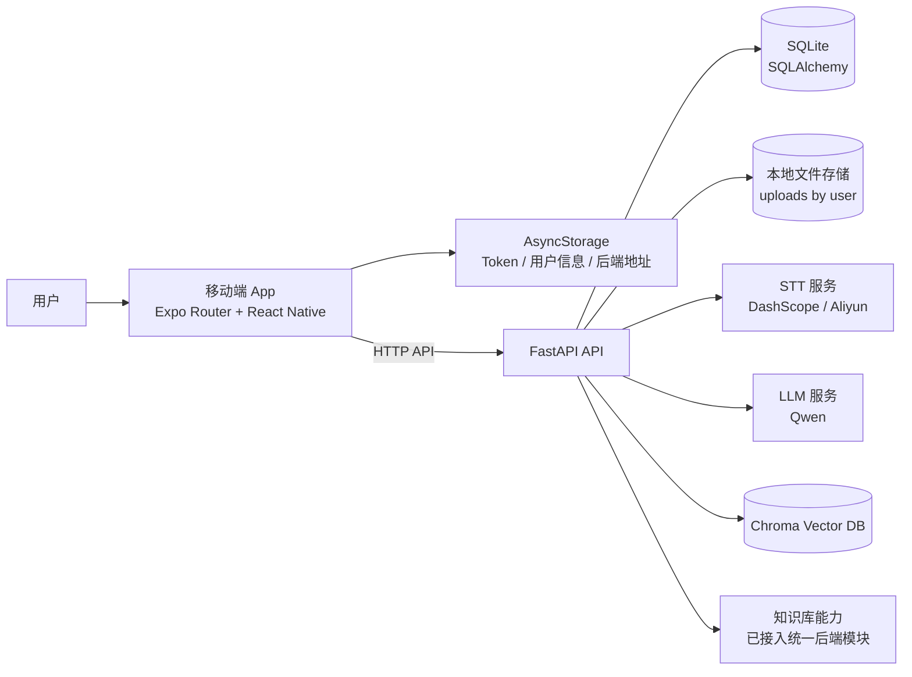
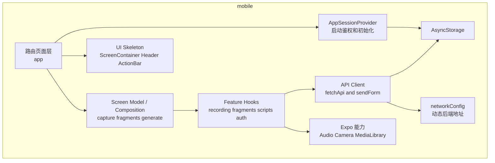
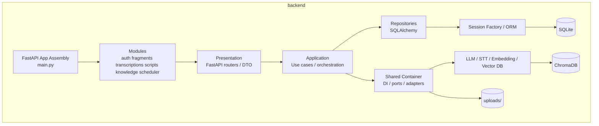
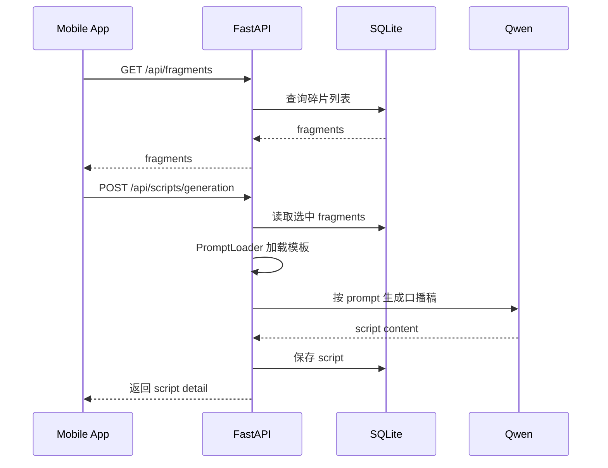
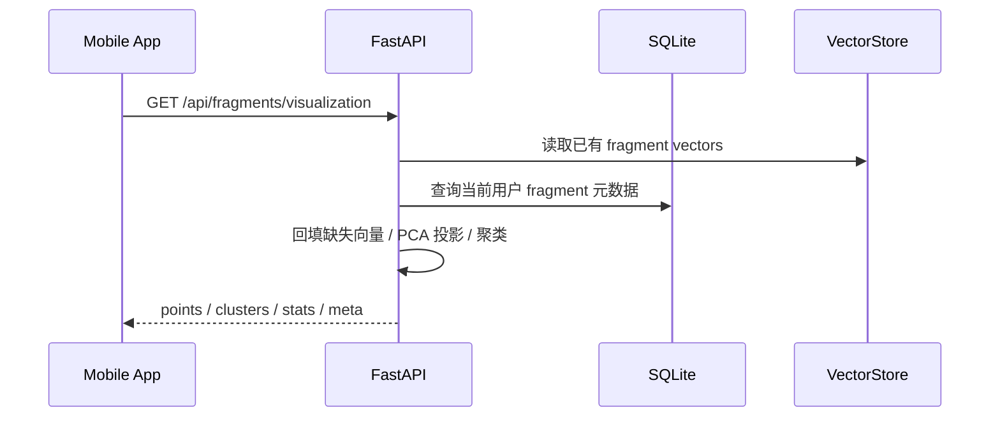
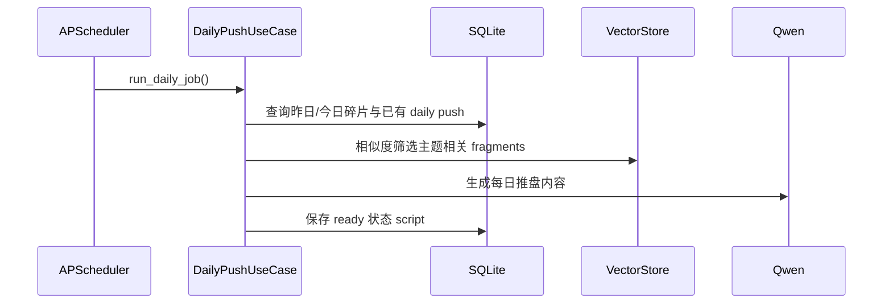

# SparkFlow Architecture

本文档描述 SparkFlow 当前代码实现对应的前后端架构。当前项目形态是 Expo/React Native 移动端应用配合 FastAPI 后端服务，不是传统浏览器 Web 前端。

## 1. Overall

## 2. Frontend Architecture

移动端代码位于 `mobile/`，以 Expo Router 组织路由，以 screen composition + feature hooks + API client 组织业务调用。

### 2.1 Frontend Layers

- `mobile/app/`: 路由入口与页面装配层，只负责导航、参数读取和拼装页面骨架。
- `mobile/features/*/use*Screen.ts`: screen model / composition 层，聚合多个 hooks，输出页面直接消费的 view state、按钮状态和导航动作。
- `mobile/components/layout/`: 通用页面骨架层，提供 `ScreenContainer`、`ScreenHeader`、`BottomActionBar` 等统一布局能力。
- `mobile/providers/`: 会话初始化、全局状态挂载。
- `mobile/features/*/hooks.ts`: 业务 hooks 层，管理 loading、error、提交动作和设备能力调用。
- `mobile/features/*/api.ts`: 面向具体业务的 API 封装。
- `mobile/features/core/api/client.ts`: HTTP 基础设施，负责 token、重试、统一错误处理。
- `mobile/constants/config.ts` + `mobile/utils/networkConfig.ts`: 后端地址管理。
- `mobile/components/`: 业务通用 UI 组件，如 `FragmentCard`、`ScriptCard`、`ScreenState`。

### 2.2 Frontend Navigation and Screen Responsibilities

- tabs 主导航固定为 `捕获 / 碎片 / 我的`，以创作流优先组织一级入口。
- `捕获`页负责录音、文本输入、当日上传状态和每日推盘触发。
- `碎片`页负责碎片浏览、选择、进入 AI 编导，以及云图入口。
- `我的`页负责用户信息、稿件入口和系统设置。
- `generate` 是从碎片选择流进入的独立步骤页，只负责确认输入和触发生成。
- `scripts` 是“我的口播稿”二级列表页，不承担生成入口。

### 2.3 Frontend Initialization

应用启动后，`AppSessionProvider` 会完成以下初始化流程：

1. 初始化后端地址配置。
2. 从 `AsyncStorage` 读取 token 和用户信息。
3. 如果没有 token，则调用 `/api/auth/token` 获取测试用户 JWT。
4. 将会话状态注入页面树。

### 2.4 Frontend Layout Conventions

- tab 一级页面关闭原生导航栏，统一使用页面内部 `ScreenHeader`，避免系统 header 与业务 header 叠加。
- 二级页面按需决定是否保留 stack header；自定义页面头部时会显式关闭原生 header。
- 底部主操作统一通过 `BottomActionBar` 承载，避免各页面重复实现固定底栏。
- 主题层在 `mobile/theme/tokens.ts` 中增加了 `layout` 语义 token，用于统一页面边距、区块间距和底部操作区留白。

## 3. Backend Architecture

后端代码位于 `backend/`。当前后端已经重构为模块化单体，按业务模块拆分，并统一收敛为 `presentation / application / shared infrastructure` 的依赖方向。

### 3.1 Backend Layers

- `backend/main.py`: FastAPI 应用装配入口，只负责创建 app、注册路由、异常处理、生命周期和健康检查。
- `backend/modules/*/presentation.py`: 模块对外 API 层，定义 FastAPI router、请求参数和响应入口。
- `backend/modules/*/application.py`: 模块应用服务层，负责流程编排、事务边界和状态流转。
- `backend/modules/shared/container.py`: 统一依赖装配层，负责创建 session factory、provider、文件存储、prompt loader、vector store。
- `backend/modules/shared/ports.py`: 后端内部端口接口，约束 STT、LLM、Embedding、VectorStore、AudioStorage、JobRunner。
- `backend/modules/shared/enrichment.py`: 转写增强共享能力，承载 summary/tags 生成与 fallback 逻辑，避免业务模块回退到旧 `services` 业务 helper。
- `backend/domains/*/repository.py`: 仍保留为 SQLAlchemy 数据访问层，供新 application 层复用。
- `backend/models/`: SQLAlchemy 模型、引擎、Session 管理。
- `backend/services/`: 仅保留外部 provider 实现、抽象基类与 factory，不再暴露业务流程 helper。
- `backend/prompts/`: 口播稿生成 Prompt 模板，由 `PromptLoader` 读取。

### 3.2 Backend Service Boundaries

- 认证：JWT 鉴权，当前默认使用测试用户 token。
- 碎片：碎片 CRUD、相似检索、向量可视化。
- 转写：上传音频、创建 fragment、后台异步调用 STT、回写 transcript/summary/tags、向量化。
- 口播稿：读取 fragments、加载 prompt、调用 LLM 生成 script、每日推盘生成。
- 知识库：文档创建、上传、检索、删除，统一接入向量存储。
- 调度：定时触发每日推盘 use case，本身不承载业务规则。

### 3.3 Data and External Dependencies

- 主数据库：SQLite。
- ORM：SQLAlchemy。
- 音频存储：本地文件系统 `uploads/{user_id}/`。
- LLM：通过 shared container 装配，默认使用 `services/factory.py` 创建的 Qwen provider。
- STT：通过 shared container 装配，当前支持 DashScope 或 Aliyun。
- Embedding：通过 shared container 装配，默认 Qwen embedding。
- 向量库：通过 `VectorStore` 端口统一访问，当前底层默认 ChromaDB，本地持久化。
- Prompt：通过 `PromptLoader` 从 `backend/prompts/` 加载。
- 业务增强：summary/tags 与向量写入等跨模块辅助逻辑已收敛到 `modules/shared/*` 和模块 application 层，不再通过 legacy `domains/*/service.py` 或 `services/*_service.py` 暴露。

### 3.4 Backend Module Layout

- `backend/modules/auth`: token 签发、刷新、当前用户信息。
- `backend/modules/fragments`: fragment CRUD、similar、visualization。
- `backend/modules/transcriptions`: 音频上传、转写状态查询、后台转写任务。
- `backend/modules/scripts`: script 生成、查询、更新、删除、daily push。
- `backend/modules/knowledge`: knowledge 文档创建、上传、列表、搜索、删除。
- `backend/modules/scheduler`: 定时任务装配与启动停止。
- `backend/modules/shared`: 容器、端口定义、共享适配器。

## 4. Core Business Flows

### 4.1 Audio Recording and Transcription

说明：

- 前端录音依赖 Expo Audio。
- 上传成功后，接口立即返回，转写在后台异步执行。
- 转写成功后会补充 `transcript`、`summary`、`tags`。
- 成功后会继续写入向量库，供 similar / daily push / visualization 使用。
- 转写失败则 fragment 标记为 `failed`。

### 4.2 Script Generation

说明：

- 只有存在有效转写内容的 fragments 才能参与合稿。
- 合稿模式由前端传入：`mode_a` 或 `mode_b`。
- Prompt 模板位于 `backend/prompts/`，由 shared container 中的 `PromptLoader` 统一读取。

### 4.3 Fragment Visualization

说明：

- 可视化现在由 `backend/modules/fragments/visualization.py` 负责。
- 该链路已经不再依赖旧的 `services/vector_visualization_service.py`。
- 若用户还没有完整向量数据，会基于文本特征做 fallback projection。

### 4.4 Daily Push

说明：

- 手动触发入口为 `/api/scripts/daily-push/trigger` 和 `/api/scripts/daily-push/force-trigger`。
- 定时任务只负责触发 use case，业务规则都在 `backend/modules/scripts/application.py`。

## 5. Request Path Mapping

典型调用路径如下：

- 页面层 `mobile/app/*`
- screen model 层 `mobile/features/*/use*Screen.ts`
- hooks 层 `mobile/features/*/hooks.ts`
- API 封装层 `mobile/features/*/api.ts`
- HTTP Client `mobile/features/core/api/client.ts`
- FastAPI Router `backend/modules/*/presentation.py`
- Application Service `backend/modules/*/application.py`
- Shared Container / Port Adapter `backend/modules/shared/*`
- Repository `backend/domains/*/repository.py`
- SQLite / uploads / STT / LLM / ChromaDB

当前主要 API 路径如下：

- `GET /`
- `GET /health`
- `POST /api/auth/token`
- `GET /api/auth/me`
- `POST /api/auth/refresh`
- `GET /api/fragments`
- `POST /api/fragments`
- `GET /api/fragments/{fragment_id}`
- `DELETE /api/fragments/{fragment_id}`
- `POST /api/fragments/similar`
- `GET /api/fragments/visualization`
- `POST /api/transcriptions`
- `GET /api/transcriptions/{fragment_id}`
- `POST /api/scripts/generation`
- `GET /api/scripts`
- `GET /api/scripts/daily-push`
- `POST /api/scripts/daily-push/trigger`
- `POST /api/scripts/daily-push/force-trigger`
- `GET /api/scripts/{script_id}`
- `PATCH /api/scripts/{script_id}`
- `DELETE /api/scripts/{script_id}`
- `POST /api/knowledge`
- `POST /api/knowledge/upload`
- `GET /api/knowledge`
- `POST /api/knowledge/search`
- `GET /api/knowledge/{doc_id}`
- `DELETE /api/knowledge/{doc_id}`

## 6. Current Architectural Characteristics

- 移动端本地保存 token 和后端地址，适合真机调试。
- 移动端前端已从“页面直接组合 hooks”调整为“薄路由页 + screen model + 通用布局骨架”的结构。
- 一级导航按创作流组织，页面职责更明确，减少首页和列表页的业务混杂。
- 后端已经从旧的 `routers + domains + services` 组合，重构成模块化单体。
- 旧的 `domains/*/service.py`、`domains/transcription/workflow.py`、`services/scheduler.py`、`services/llm_service.py`、`services/vector_service.py` 已移除，避免出现双入口业务实现。
- 依赖注入集中在 shared container，业务代码不再直接依赖全局 `SessionLocal` 或 legacy provider helper。
- 外部 AI 能力通过端口接口接入，仍保留替换供应商的扩展性。
- 转写链路使用异步后台任务，用户等待成本较低。
- 知识库和碎片可视化已经纳入统一后端架构，而不是预留接口。
- 测试已覆盖当前全部公开 API 路径，并补充了 `/`、`/health`、401/404/422、上传校验与路由契约检查，后端重构后的边界有自动化保护。

## 7. Key Entry Files

- Frontend entry: `mobile/app/_layout.tsx`
- Tab navigation: `mobile/app/(tabs)/_layout.tsx`
- Session bootstrap: `mobile/providers/AppSessionProvider.tsx`
- Screen shell: `mobile/components/layout/ScreenContainer.tsx`
- Screen composition: `mobile/features/capture/useCaptureScreen.ts`
- Fragments composition: `mobile/features/fragments/useFragmentsScreen.ts`
- Generate composition: `mobile/features/scripts/useGenerateScreen.ts`
- API client: `mobile/features/core/api/client.ts`
- Recording flow: `mobile/features/recording/hooks.ts`
- Backend entry: `backend/main.py`
- Container / DI: `backend/modules/shared/container.py`
- Auth module: `backend/modules/auth/presentation.py`
- Fragments module: `backend/modules/fragments/presentation.py`
- Fragment visualization: `backend/modules/fragments/visualization.py`
- Transcriptions module: `backend/modules/transcriptions/presentation.py`
- Scripts module: `backend/modules/scripts/application.py`
- Knowledge module: `backend/modules/knowledge/presentation.py`
- Scheduler module: `backend/modules/scheduler/application.py`
- Repositories: `backend/domains/*/repository.py`
- Provider factory: `backend/services/factory.py`
