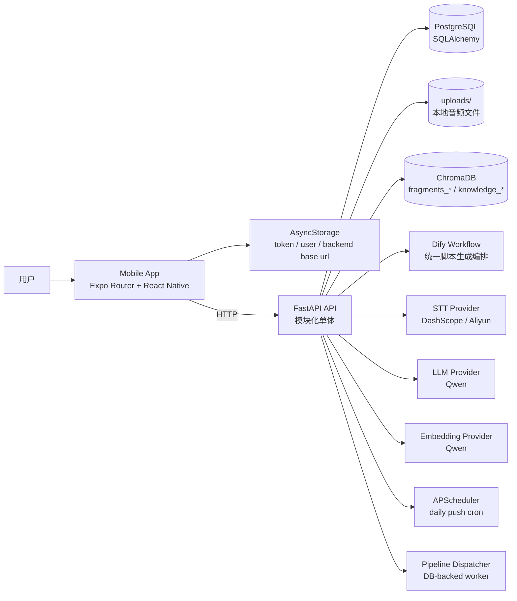
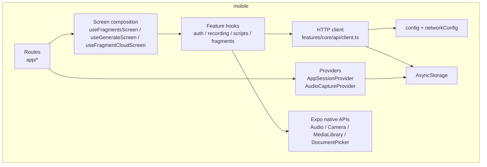
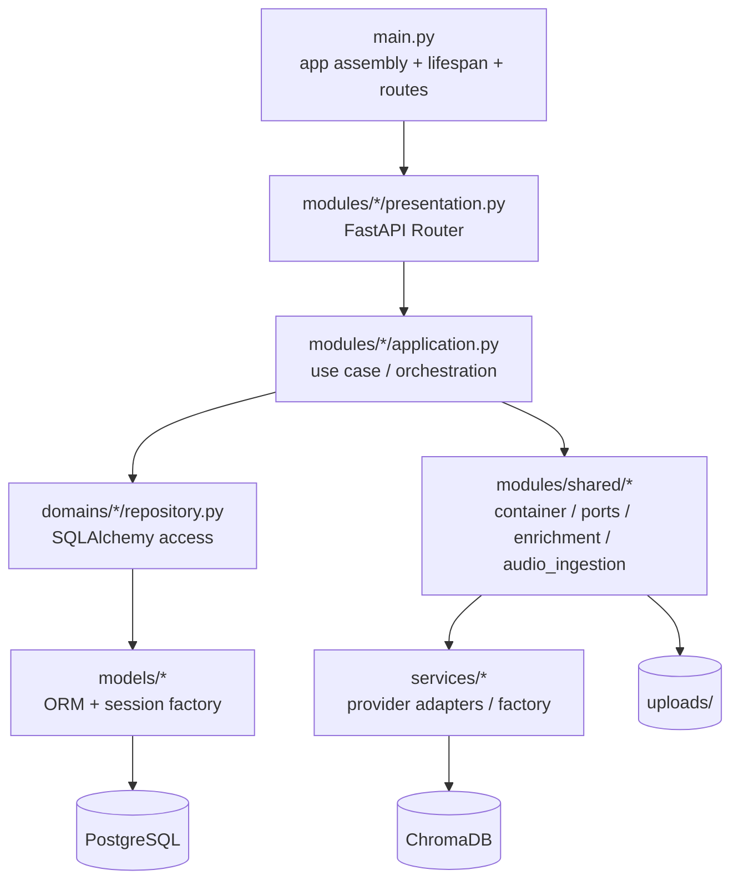
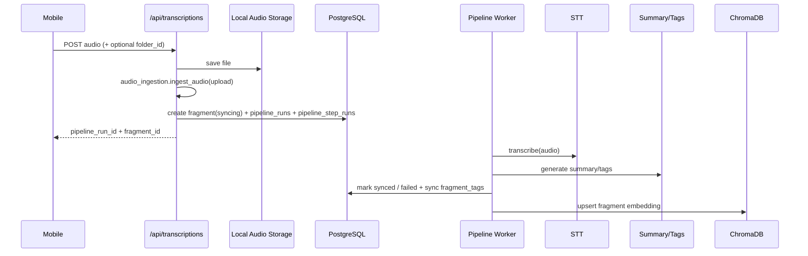
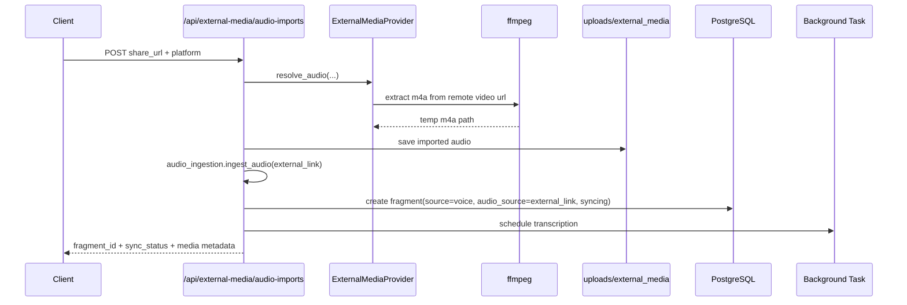
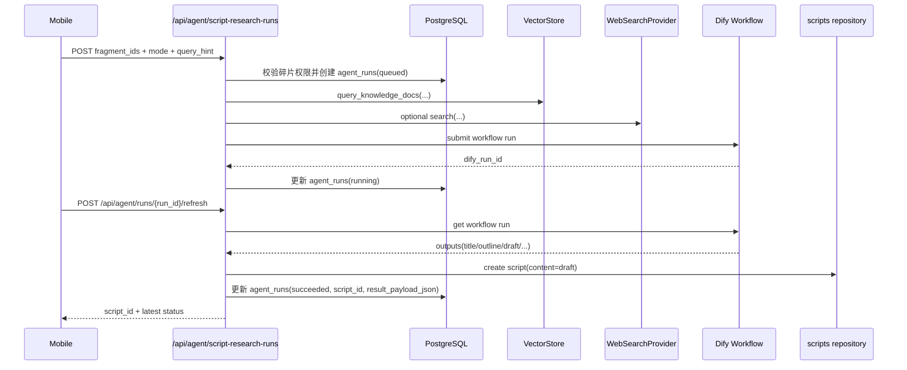
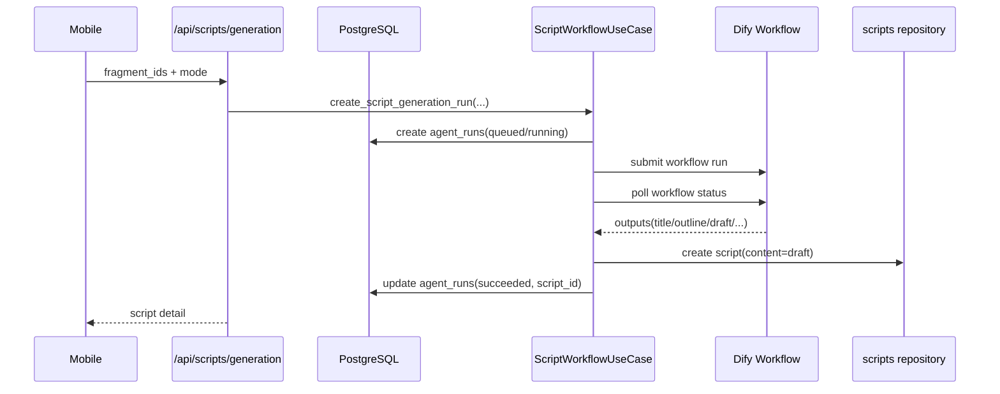
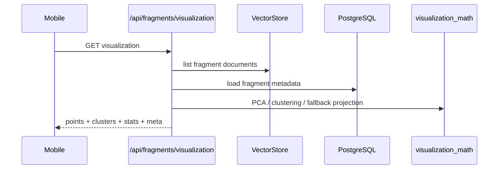
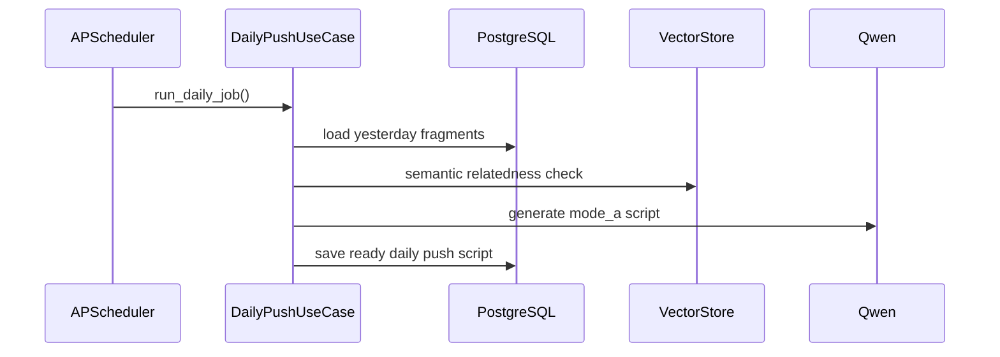

# SparkFlow Architecture

> 最后更新：2026-03-09

本文档描述当前仓库已经落地的实际架构，而不是早期规划版本。SparkFlow 目前是一个 Expo / React Native 移动端应用，配合 FastAPI 模块化单体后端运行，后端本地开发默认数据库已切换为 PostgreSQL。

## 1. Overall

## 2. Repository Shape

- `mobile/`: Expo 移动端，当前采用 stack 路由，不是 tab 路由。
- `backend/`: FastAPI 后端，业务入口已经收敛到 `modules/*`。
- `scripts/dev-mobile.sh`: 推荐本地联调入口，同时启动后端与 Expo。
- `scripts/dify-local.sh`: 本地自托管 Dify 启停脚本，会拉取官方 release 并在 `backend/.vendor/dify` 下准备 Docker 部署目录。
- `memory-bank/`: 产品、架构、进度与实施记录。

## 3. Mobile Architecture

### 3.1 Routing

移动端路由位于 `mobile/app/`，由 [`mobile/app/_layout.tsx`](/Users/hujiahui/Desktop/VibeCoding/SparkFlow/mobile/app/_layout.tsx) 统一挂载 `Stack`。

当前主要页面：

- `index.tsx`: 实际首页，展示碎片列表、分组、选择态和底部快捷操作。
- `record-audio.tsx`: 录音与上传页。
- `text-note.tsx`: 手动文本碎片录入页。
- `fragment/[id].tsx`: 单条碎片详情。
- `fragment-cloud.tsx`: 灵感云图。
- `generate.tsx`: AI 编导生成确认页。
- `script/[id].tsx`: 口播稿详情。
- `scripts.tsx`: 口播稿列表。
- `shoot.tsx`: 提词器 + 相机拍摄。
- `profile.tsx`: 创作工作台。
- `knowledge.tsx`: 知识库占位页，当前还不是完整管理入口。
- `network-settings.tsx`: 后端地址配置页。

### 3.2 Runtime Layers

### 3.3 Mobile Responsibilities

- `AppSessionProvider` 在应用启动时完成后端地址初始化、token 恢复、测试用户自动登录。
- `AudioCaptureProvider` 承载录音状态、上传状态与录音文件回放能力。
- `features/core/api/client.ts` 统一处理 token 注入、错误解析与基础请求方法。
- `utils/networkConfig.ts` 负责后端地址持久化与真机局域网地址切换。
- `features/fragments/*` 负责碎片列表、多选、云图和详情相关状态。
- `features/scripts/*` 负责口播稿生成、列表、详情状态和每日推盘 API 调用。

### 3.4 Local Persistence

当前移动端真正参与主流程的数据持久化是：

- `AsyncStorage`: token、用户信息、后端 base URL

当前移动端主流程的本地持久化只使用 `AsyncStorage`，未引入 SQLite 业务存储链路。

## 4. Backend Architecture

### 4.1 Layers

后端代码位于 `backend/`，已演进为模块化单体结构。

### 4.2 Actual Boundaries

- [`backend/main.py`](/Users/hujiahui/Desktop/VibeCoding/SparkFlow/backend/main.py): 创建 FastAPI app、注册 request-id 中间件、异常处理器、静态文件、路由和 scheduler 生命周期。
- `backend/modules/*/presentation.py`: 对外 HTTP 入口。
- `backend/modules/*/schemas.py`: 当前模块自有的 API request/response DTO，避免跨目录重复定义 contract。
- `backend/modules/*/application.py`: 业务编排与用例。
- `backend/domains/*/repository.py`: 仓储层，只负责 SQLAlchemy 数据访问。
- `backend/models/*`: ORM 模型、数据库 engine、session 工厂。

当前约定：

- 模块内 `schemas.py` 是后端 API contract 的单一事实源。
- `presentation.py` 应显式声明 `response_model=ResponseModel[...]`，让 OpenAPI 可直接作为前后端并行开发的契约。
- 删除接口统一返回 `200 + ResponseModel[None]`，成功时 `data` 为 `null`。
- `backend/modules/shared/container.py`: DI 容器、`PromptLoader`、`AudioStorage`、`VectorStore` 适配器。
- `backend/modules/shared/ports.py`: LLM、STT、Embedding、Vector DB、音频存储等端口抽象。
- `backend/modules/shared/enrichment.py`: 摘要与标签增强逻辑。
- `backend/modules/shared/audio_ingestion.py`: 统一音频碎片导入流水线步骤，负责媒体导入、转写、增强和向量化。
- `backend/modules/shared/pipeline_runtime.py`: 持久化后台流水线运行时，负责步骤定义、worker 抢占、自动重试与恢复。
- `backend/services/*`: 当前主要保留外部 provider 实现与工厂；新增业务逻辑应优先进入 `modules/*` 或 `modules/shared/*`，而不是继续扩散到 legacy service 文件。

### 4.3 Backend Folder Map

- `backend/core/`: 配置、认证、统一响应模型、异常体系和结构化日志配置。
- `backend/constants/`: 共享常量定义。
- `backend/utils/`: 时间、序列化等通用工具。
- `backend/modules/`: 当前后端主业务入口，按业务模块拆分。
- `backend/modules/shared/`: 多模块共享端口、容器和公共能力，不单独对外暴露业务路由。
- `backend/domains/`: 仓储目录，按业务实体或聚合划分查询与写入逻辑。
- `backend/models/`: SQLAlchemy ORM 模型和数据库初始化。
- `backend/services/`: 外部 provider 的适配实现和实例工厂。
- `backend/prompts/`: LLM prompt 模板。
- `backend/alembic/`: 数据库迁移脚本。
- `backend/tests/`: 后端自动化测试。
- `backend/uploads/`: 本地音频文件存储。
- `backend/chroma_data/`: 本地向量库持久化目录。
- `backend/runtime_logs/`: 运行时日志目录，当前包含移动端错误日志落盘文件。
- `backend/scripts/`: 后端辅助脚本。

### 4.4 Backend Modules

- `auth`: 测试 token 签发、当前用户信息、refresh。
- 本地联调会确保默认测试用户 `test-user-001` 在数据库中存在，避免恢复旧 token 时触发用户外键错误。
- `fragment_folders`: 碎片文件夹 CRUD、文件夹内碎片数量统计。
- `fragments`: 列表、创建、详情、更新归类、批量移动、删除、相似检索、可视化。
- `transcriptions`: 音频上传、后台转写、状态查询，上传入口会创建 `source=voice`、`audio_source=upload` 的碎片。
- `external_media`: 外部媒体音频导入，当前支持抖音分享链接下载并转成 m4a，导入完成后直接创建 `source=voice`、`audio_source=external_link` 的碎片并接入同一条转写管线。
- `scripts`: 合稿、列表、详情、更新、删除、每日推盘。
- `knowledge`: 文档创建、上传、列表、搜索、详情、删除。
- `agent`: Dify 统一脚本工作流入口、run 状态查询与 refresh。
- `pipelines`: 后台流水线详情、步骤查询与手动重跑入口。
- `backend/dify_dsl/`: 仓库内置的 Dify DSL 模板目录，当前提供 `sparkflow_script_generation.workflow.yml` 供导入。
- `debug_logs`: 移动端调试日志接收，并复用结构化日志链路落盘。
- `scheduler`: APScheduler 装配与启停。

### 4.5 Backend Coding Conventions

- 新增接口时，优先补模块内 `schemas.py`，不要把 request/response model 内联到 `presentation.py`。
- `presentation.py` 只负责 HTTP 适配，不承载核心业务规则。
- `application.py` 负责用例编排、数据校验、错误抛出和 provider 调用。
- repository 仅负责数据读写，不承载流程级业务编排。
- 如需跨模块复用，优先抽到 `modules/shared/`；不要回退到早期全局 schema 组织方式。
- 所有对外接口默认走标准响应包裹 `ResponseModel`，并补中文 `summary` / `description`。
- 注释应简短，只解释非显然业务约束或实现原因。

### 4.6 External Dependencies

- LLM: 默认 `Qwen`，通过 `services/factory.py` 创建。
- STT: 默认 `DashScope`，保留 Aliyun 兼容实现。
- Embedding: 默认 `Qwen text-embedding-v2`。
- Vector DB: 默认 `ChromaDB`。
- Agent Workflow: 可选 `Dify`，由后端通过 HTTP API 调用。
- Dify Local Runtime: 若采用仓库内置脚本自托管，默认通过 `Docker Compose + PostgreSQL profile` 运行，并映射到 `127.0.0.1:18080`。
- Storage: 本地文件系统 `backend/uploads/<user_id>/`。
- Database: PostgreSQL（本地开发默认）。

### 4.7 Namespaces and Storage Conventions

- 碎片文件夹表：`fragment_folders`
- 碎片归一化标签表：`fragment_tags`
- `fragments.folder_id` 指向真实文件夹；“全部”只是前端系统视图，不落库。
- `fragments.audio_source` 用于区分音频来源；当前取值为 `upload` / `external_link` / `null`
- 碎片向量 namespace: `fragments_{user_id}`
- 知识库向量 namespace: `knowledge_{user_id}`
- 外挂工作流运行表：`agent_runs`
- 后台流水线表：`pipeline_runs` / `pipeline_step_runs`
- 上传音频路径: `uploads/<user_id>/...`
- 移动端调试日志文件: `runtime_logs/mobile-debug.log`
- 每日推盘调度时间：使用 `APP_TIMEZONE`，默认 `Asia/Shanghai`，时间点由 `DAILY_PUSH_HOUR` / `DAILY_PUSH_MINUTE` 控制

### 4.8 Logging and Test Baseline

- HTTP 请求入口统一绑定 `request_id`，并通过 `structlog` 输出结构化日志。
- 关键后台链路日志字段至少包含 `event`、`request_id`、`path`、`module`，核心转写链路额外补 `fragment_id`、`user_id`、`provider`、`attempt`。
- 移动端调试日志通过独立 file handler 写入 `runtime_logs/mobile-debug.log`，但字段格式与主日志链路保持一致。
- 后端自动化测试已切换到 `pytest`。
- OpenAPI 契约 smoke 校验通过 `Schemathesis` 直接消费 `/openapi.json`，不维护第二套独立契约文件。

## 5. Core Flows

### 5.1 Audio Upload and Async Transcription

关键点：

- 上传接口立即返回，转写在后台继续执行。
- 转写完成后会写回 `transcript`、`summary`、`tags`、`speaker_segments`，并同步刷新 `fragment_tags` 明细。
- 向量写入失败不会回滚主转写结果。

### 5.2 External Media Audio Import

关键点：

- 当前接口会在保存外部音频后直接创建 fragment，并接入统一后台转写链路。
- 对外接口按多平台抽象设计，但 v1 只有抖音 provider。
- 导入文件统一保存到 `uploads/external_media/<user_id>/<platform>/`，输出格式固定为 `m4a`。
### 5.3 Dify Script Research Workflow

关键点：

- Dify 只负责外挂生成步骤，不直接访问 PostgreSQL、ChromaDB 或业务表。
- fragments、knowledge hits 和可选 web hits 都由 SparkFlow 后端先收集。
- 后端提交给 Dify 前，会将 `selected_fragments`、`knowledge_hits`、`web_hits`、`user_context`、`generation_metadata` 序列化为 JSON 字符串，以兼容 Dify Start 节点。
- `pipeline_runs` / `pipeline_step_runs` 是后台状态事实源；`agent_runs` 仅保留兼容查询与 Dify 投影。
- 仓库内置的 DSL 模板位于 `backend/dify_dsl/sparkflow_script_generation.workflow.yml`，可直接导入本地 Dify。

### 5.4 Script Generation

关键点：

- 当前支持 `mode_a` 和 `mode_b`。
- `POST /api/scripts/generation` 已统一走 Dify 工作流，不再直接调用本地 PromptLoader + Qwen 生成脚本。
- 真实本地联调已经验证：Dify 输出 `draft` 后，SparkFlow 后端会回流创建 `scripts` 记录。
- `mode_a` / `mode_b` 目前共享同一条 Dify 工作流，由工作流内部根据 `mode` 分支处理。

### 5.5 Fragment Visualization

关键点：

- 实现位于 `backend/modules/fragments/visualization.py`。
- 首版走轻量 PCA + 聚类，不依赖重型 3D 栈。

### 5.6 Daily Push

关键点：

- scheduler 在 FastAPI lifespan 内启动与停止。
- 手动触发接口已存在：`/api/scripts/daily-push/trigger` 和 `/api/scripts/daily-push/force-trigger`。
- 当前后端链路已完成，但首页“每日灵感卡片”还没有稳定接入到实际主页面。

## 6. Current API Surface

当前主要公开 API：

- `GET /`
- `GET /health`
- `POST /api/auth/token`
- `GET /api/auth/me`
- `POST /api/auth/refresh`
- `GET /api/fragments`
- `POST /api/fragments`
- `POST /api/fragments/move`
- `GET /api/fragments/tags`
- `GET /api/fragments/{fragment_id}`
- `PATCH /api/fragments/{fragment_id}`
- `DELETE /api/fragments/{fragment_id}`
- `POST /api/fragments/similar`
- `GET /api/fragments/visualization`
- `GET /api/fragment-folders`
- `POST /api/fragment-folders`
- `PATCH /api/fragment-folders/{folder_id}`
- `DELETE /api/fragment-folders/{folder_id}`
- `POST /api/transcriptions`
- `GET /api/transcriptions/{fragment_id}`
- `POST /api/scripts/generation`
- `GET /api/scripts`
- `GET /api/scripts/daily-push`
- `POST /api/scripts/daily-push/trigger`
- `POST /api/scripts/daily-push/force-trigger`
- `GET /api/scripts/{script_id}`
- `PATCH /api/scripts/{script_id}`
- `DELETE /api/scripts/{script_id}`
- `POST /api/knowledge`
- `POST /api/knowledge/upload`
- `GET /api/knowledge`
- `POST /api/knowledge/search`
- `GET /api/knowledge/{doc_id}`
- `DELETE /api/knowledge/{doc_id}`
- `POST /api/debug/mobile-logs`

## 7. Key Entry Files

- Frontend app entry: [`mobile/app/_layout.tsx`](/Users/hujiahui/Desktop/VibeCoding/SparkFlow/mobile/app/_layout.tsx)
- Frontend home: [`mobile/app/index.tsx`](/Users/hujiahui/Desktop/VibeCoding/SparkFlow/mobile/app/index.tsx)
- Session bootstrap: [`mobile/providers/AppSessionProvider.tsx`](/Users/hujiahui/Desktop/VibeCoding/SparkFlow/mobile/providers/AppSessionProvider.tsx)
- Fragment screen model: [`mobile/features/fragments/useFragmentsScreen.ts`](/Users/hujiahui/Desktop/VibeCoding/SparkFlow/mobile/features/fragments/useFragmentsScreen.ts)
- Generate screen model: [`mobile/features/scripts/useGenerateScreen.ts`](/Users/hujiahui/Desktop/VibeCoding/SparkFlow/mobile/features/scripts/useGenerateScreen.ts)
- Fragment cloud model: [`mobile/features/fragments/useFragmentCloudScreen.ts`](/Users/hujiahui/Desktop/VibeCoding/SparkFlow/mobile/features/fragments/useFragmentCloudScreen.ts)
- Audio state provider: [`mobile/features/recording/AudioCaptureProvider.tsx`](/Users/hujiahui/Desktop/VibeCoding/SparkFlow/mobile/features/recording/AudioCaptureProvider.tsx)
- API client: [`mobile/features/core/api/client.ts`](/Users/hujiahui/Desktop/VibeCoding/SparkFlow/mobile/features/core/api/client.ts)
- Backend entry: [`backend/main.py`](/Users/hujiahui/Desktop/VibeCoding/SparkFlow/backend/main.py)
- Service container: [`backend/modules/shared/container.py`](/Users/hujiahui/Desktop/VibeCoding/SparkFlow/backend/modules/shared/container.py)
- Fragments module: [`backend/modules/fragments/presentation.py`](/Users/hujiahui/Desktop/VibeCoding/SparkFlow/backend/modules/fragments/presentation.py)
- Fragment folders module: [`backend/modules/fragment_folders/presentation.py`](/Users/hujiahui/Desktop/VibeCoding/SparkFlow/backend/modules/fragment_folders/presentation.py)
- Fragment visualization: [`backend/modules/fragments/visualization.py`](/Users/hujiahui/Desktop/VibeCoding/SparkFlow/backend/modules/fragments/visualization.py)
- Transcriptions module: [`backend/modules/transcriptions/application.py`](/Users/hujiahui/Desktop/VibeCoding/SparkFlow/backend/modules/transcriptions/application.py)
- Scripts module: [`backend/modules/scripts/application.py`](/Users/hujiahui/Desktop/VibeCoding/SparkFlow/backend/modules/scripts/application.py)
- Knowledge module: [`backend/modules/knowledge/application.py`](/Users/hujiahui/Desktop/VibeCoding/SparkFlow/backend/modules/knowledge/application.py)
- Scheduler module: [`backend/modules/scheduler/application.py`](/Users/hujiahui/Desktop/VibeCoding/SparkFlow/backend/modules/scheduler/application.py)

## 8. Current Architectural Notes

- 代码已经从早期的 `routers + service` 形态迁移到 `modules/*` 主入口，但仓库里仍保留一部分 provider 与兼容性 service 文件，不应再把它们当成新的业务层规范。
- 碎片管理现在分为“真实文件夹 + 全部系统视图”两层：文件夹模块负责容器管理，碎片模块负责内容与归类变更。
- `GET /api/fragments` 当前已支持按 `folder_id` 和单个 `tag` 精确过滤；`GET /api/fragments/tags` 提供热门 Tag 与模糊建议能力。
- Tag 对外仍通过 `fragments.tags` 返回，后端使用 `fragment_tags` 作为 Tag 聚合、建议与过滤的查询主表。
- 移动端当前是“碎片列表优先”的首页结构，不是 PRD 里最初设想的 tab 首页。
- 知识库后端已可用，移动端入口仍是占位页。
- 每日推盘后端已可运行并带有定时任务，但前端主入口尚未完整消费这条能力。
- 当前最稳定的本地开发方式是根目录执行 `bash scripts/dev-mobile.sh`，而不是分别手动起多个进程。

## 9. Frontend / Backend Collaboration

随着移动端与后端可能由不同成员并行开发，当前仓库默认采用“契约驱动 + 用户流驱动”的协作方式。

### 9.1 Collaboration Defaults

- 需求以用户流拆分，不只按前端页面或后端接口拆分。
- 后端模块内 `schemas.py` 是 API contract 单一事实源。
- `presentation.py` 上声明的 `response_model=ResponseModel[...]` 与 `/docs`、`/redoc` 一起构成前后端联调契约。
- 前端可以基于 contract 先做 mock 和页面状态流，不等待后端完整实现。
- 后端字段应尽量追加兼容，避免无通知的破坏性改动。

### 9.2 Expected Workflow

1. 先明确用户流与验收标准。
2. 后端先定义最小 request / response contract。
3. 前端按 contract 完成页面、loading、empty、error 和 mock。
4. 后端补齐真实业务实现、测试和响应样例。
5. 双方通过 `bash scripts/dev-mobile.sh` 做本地联调。
6. 合并前同步更新 README / architecture / API 示例。

### 9.3 Current Coordination Rules

- 新接口优先新增或更新模块内 `schemas.py`，不要只在聊天里约定字段。
- 涉及状态流转的接口，联调时必须覆盖“处理中 / 成功 / 失败”三个方向。
- 联调问题优先结合 `backend/runtime_logs/mobile-debug.log` 与后端接口日志排查，而不是只看前端截图。
- 启动方式、环境假设或模块边界发生变化时，文档必须与代码同一轮更新。

更完整的执行细则见 [`memory-bank/frontend-backend-collaboration.md`](/Users/hujiahui/Desktop/VibeCoding/SparkFlow/memory-bank/frontend-backend-collaboration.md)。
